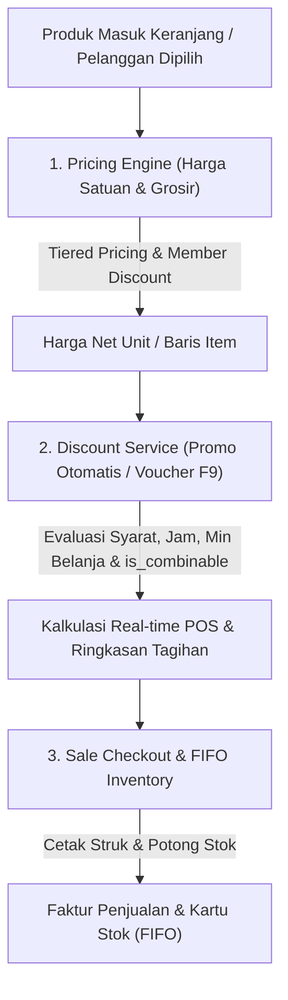

# 🏷️ Dokumentasi Sistem & Aturan Diskon POS

Dokumen ini berisi panduan lengkap arsitektur, jenis promosi, aturan kombinasi (*is_combinable*), prioritas eksekusi (*precedence*), alur real-time di POS, struk kasir, hingga integrasi inventori stok FIFO.

---

## 1. 🏗️ Struktur & Lapisan Diskon

Sistem diskon pada aplikasi POS ini terbagi menjadi 3 tingkatan utama:



| Tingkatan | Sumber Data | Keterangan & Perilaku |
| :--- | :--- | :--- |
| **Lapis 1: Harga Bertingkat & Member** | `TieredPrice`, `CustomerGroup` | Otomatis memotong harga dasar satuan produk berdasarkan jumlah beli (grosir) atau keanggotaan pelanggan. |
| **Lapis 2: Program Promosi & Voucher** | `Discount`, `DiscountItem` | Menghitung promo item, promo faktur, reward barang *Buy X Get Y*, dan voucher manual kasir. |
| **Lapis 3: Potongan Kasir Manual** | Input Kasir (F9) | Potongan nominal manual darurat oleh kasir saat transaksi. |

---

## 2. 📋 Jenis-Jenis Program Diskon (`type`)

Terdapat 5 jenis program promosi yang didukung oleh sistem:

| Tipe Diskon | Nilai / Konfigurasi | Deskripsi & Contoh |
| :--- | :--- | :--- |
| `percentage_item` | `value` (%) | **Diskon Persen Per Produk**.<br>Contoh: Diskon 20% khusus Kopi Espresso. |
| `fixed_item` | `value` (Rp) | **Potongan Nominal Per Produk**.<br>Contoh: Potongan Rp 5.000 per botol Sirup. |
| `percentage_invoice` | `value` (%) | **Diskon Persen Total Faktur**.<br>Contoh: Diskon 10% untuk total belanja seluruh keranjang. |
| `fixed_invoice` | `value` (Rp) | **Potongan Nominal Total Faktur**.<br>Contoh: Potongan langsung Rp 20.000 untuk total belanja. |
| `buy_x_get_y` | `buy_qty`, `get_qty`, `reward_product_id` | **Promo Beli X Gratis Y (Reward Barang)**.<br>Contoh: Beli 2 Kopi Latte gratis 1 Donat Cokelat. |

---

## 3. 🎯 Syarat & Filter Validasi Promo

Setiap promo di tabel `discounts` divalidasi terhadap keranjang berdasarkan kriteria berikut:

1. **Status Aktif (`is_active`):** Promo wajib bernilai aktif (`true`).
2. **Periode Tanggal (`start_date` & `end_date`):** Tanggal transaksi harus berada di dalam rentang tanggal mulai s/d tanggal berakhir.
3. **Jam Berlaku / Happy Hour (`start_time` & `end_time`):** Promo dapat dibatasi pada jam tertentu (misal: 14:00:00 - 17:00:00).
4. **Minimal Belanja (`min_order_amount`):** Subtotal keranjang harus mencapai atau melebihi batas minimum.
5. **Maksimal Nilai Diskon (`max_discount_amount`):** Batas plafon potongan rupiah untuk promo tipe persentase (misal: Diskon 50% Maksimal Rp 25.000).
6. **Segmen Pelanggan (`customer_group_id`):** Jika diisi, hanya berlaku untuk pelanggan yang tergabung dalam grup tersebut (misal: Khusus Member VIP). Jika kosong, berlaku untuk semua pelanggan.
7. **Kode Promo / Voucher (`code`):**
   - **Jika `code` kosong / null:** Promo bersifat **Otomatis**, langsung diterapkan tanpa input kode.
   - **Jika `code` diisi:** Promo bersifat **Voucher**, kasir harus menekan tombol **F9** dan memasukkan kodenya.

---

## 4. 🔀 Aturan Kombinasi & Prioritas (`is_combinable`)

Aturan ini menentukan apakah beberapa promo yang memenuhi syarat dapat diakumulasikan atau harus dipilih salah satu:

### A. Definisi Status
- **`is_combinable = true` (Dapat Digabung):** Promo diizinkan untuk digabungkan dengan promo lain yang juga berstatus *combinable*.
- **`is_combinable = false` (Tidak Dapat Digabung / Eksklusif):** Promo berdiri sendiri dan **TIDAK BOLEH** ditumpuk dengan promo lain.

### B. Algoritma Pemilihan Pemenang (*Best Value Rule*)
Ketika keranjang belanja memenuhi beberapa kriteria promo sekaligus:

```
Langkah 1: Evaluasi Gabungan Promo Combinable
           Total Potongan Combinable = (Promo A + Promo B + ...)

Langkah 2: Evaluasi Setiap Promo Non-Combinable Secara Mandiri
           Nilai Potongan C1 = Promo Non-Combinable 1
           Nilai Potongan C2 = Promo Non-Combinable 2

Langkah 3: Tentukan Pemenang (Nilai Penghematan Terbesar)
           Pemenang = MAX( Total Potongan Combinable, Nilai C1, Nilai C2, ... )
```

### C. Matriks Contoh Kasus

| Kasus | Promo yang Memenuhi Syarat | Status `is_combinable` | Hasil Akhir yang Diterapkan |
| :--- | :--- | :--- | :--- |
| **1** | Promo A (Hemat 5k) & Promo B (Hemat 10k) | Keduanya `true` | **Kedua promo digabung** (Total Hemat Rp 15.000). |
| **2** | Promo A (Hemat 5k, `true`) & Promo C (Hemat 25k, `false`) | Campuran | **Hanya Promo C yang berlaku** (Hemat Rp 25.000) karena Rp 25k > Rp 5k. |
| **3** | Promo A (Hemat 15k, `true`) + Promo B (Hemat 15k, `true`) vs Promo C (Hemat 25k, `false`) | Campuran | **Promo A + Promo B yang berlaku** (Total Hemat Rp 30.000) karena Rp 30k > Rp 25k. |
| **4** | Promo X (Hemat 10k) & Promo Y (Hemat 18k) | Keduanya `false` | **Hanya Promo Y yang berlaku** (Hemat Rp 18.000) sebagai diskon mandiri terbesar. |

---

## 5. 🖥️ Alur Kerja di Halaman Kasir (POS)

1. **Kalkulasi Real-time:**
   - Endpoint `POST /pos/calculate-cart` dipanggil otomatis setiap ada perubahan keranjang (tambah item, ubah qty, ganti satuan, ganti pelanggan, atau input voucher).
2. **Tampilan Baris Item:**
   - Item yang terdiskon menampilkan badge hijau: `🏷️ [Nama Promo]: -Rp [Nominal]` beserta coretan harga asli.
3. **Baris Hadiah Gratis (*Buy X Get Y*):**
   - Otomatis memunculkan baris produk bertema emas/oranye dengan badge `🎁 [GRATIS]` dan harga Rp 0.
4. **Ringkasan Total:**
   - Kotak ringkasan menampilkan rincian `Subtotal`, `Diskon Promo`, dan `Total Tagihan (Grand Total)` secara langsung sebelum klik Bayar.

---

## 6. 🧾 Tampilan Struk & 📦 Keamanan Stok (FIFO)

### Tampilan Struk Kasir (Thermal Receipt)
- **Diskon Item:** Dicetak tepat di bawah baris kuantitas item: `2 x 25.000 (Disc: -Rp 5.000)`.
- **Baris Bonus:** Dicetak dengan tanda `[GRATIS]` dan total Rp 0.
- **Rincian Faktur:** Menampilkan baris potongan `Diskon: - Rp [Total Diskon]` sebelum Total Tagihan.

### Alur Mutasi Stok & Akuntansi (FIFO)
- Produk berbayar dipotong dari gudang aktif menggunakan batch FIFO.
- Produk gratis / bonus promo (*Buy X Get Y*) **tetap dipotong dari stok fisik gudang** dan dicatat dalam `StockMovement` keluar dengan tipe `Sale` dan referensi `"Bonus Promo [Nama Promo] - Faktur [No. Faktur]"`.
- HPP (COGS) barang bonus tetap terhitung akurat sehingga laporan laba rugi dan stok fisik gudang tidak mengalami selisih (*zero shrinkage*).
