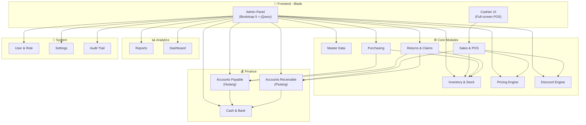
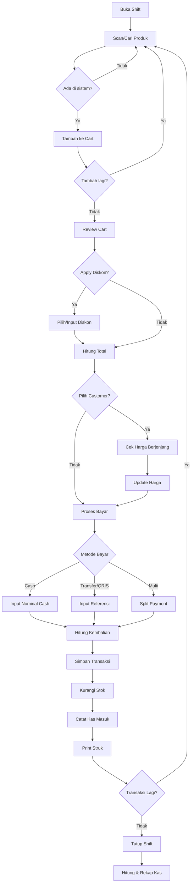
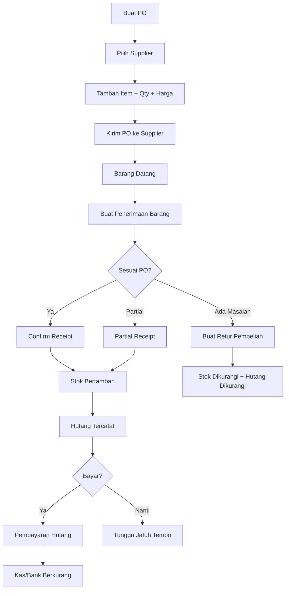

# 📋 PRD — Sistem POS Retail Profesional (Laravel)

## 1. Overview

Membangun sistem **Point of Sale (POS)** berbasis Laravel yang setara dengan aplikasi kasir profesional seperti yang digunakan di minimarket (Alfamart/Indomaret). Sistem mencakup manajemen produk multi-satuan, stok real-time, pembelian & penjualan, harga berjenjang, diskon fleksibel, hutang-piutang, retur, laporan keuangan, dan **multi-cabang**.

**Tech Stack:**
| Komponen | Teknologi |
|----------|-----------|
| **Backend** | Laravel 11 |
| **Database** | MySQL (InnoDB, utf8mb4) |
| **Frontend** | Blade Template + jQuery + Bootstrap 5 |
| **JavaScript** | Vanilla JS / jQuery (AJAX untuk interaksi dinamis) |
| **Auth** | Laravel built-in |
| **Role & Permission** | Spatie Laravel-Permission |
| **Report Export** | Laravel Excel / DomPDF |
| **Barcode** | picqer/php-barcode-generator |
| **Metode HPP** | FIFO (First In First Out) |
| **Bahasa Interface** | Bahasa Indonesia |
| **Deployment** | VPS / Shared Hosting |

> [!NOTE]
> Semua halaman dibuat manual dengan Blade, **tanpa Livewire dan tanpa Filament**. UI admin dan POS kasir dibangun sendiri dari scratch.

### Keputusan Desain

| # | Keputusan | Jawaban |
|---|-----------|--------|
| 1 | Multi-cabang | ✅ **Dari awal (Phase 1)** — Setiap transaksi terkait warehouse/outlet, user di-assign ke cabang |
| 2 | Metode HPP | ✅ **FIFO** — Harga pokok dihitung berdasarkan barang masuk pertama keluar pertama |
| 3 | Bahasa Interface | ✅ **Bahasa Indonesia** — Semua label, menu, pesan, dan laporan dalam Bahasa Indonesia |
| 4 | Deployment | ✅ **VPS / Hosting** — Optimasi untuk environment shared hosting & VPS |
| 5 | Fitur tambahan | ⏸️ **Ditunda** — Dievaluasi setelah fitur utama selesai |

---

## 2. Rangkuman Fitur Lengkap

Berikut adalah **seluruh fitur** yang akan dibuatkan. Silakan cek dan hapus/tambah jika ada yang tidak sesuai.

### 🏷️ A. Master Data

| # | Fitur | Keterangan |
|---|-------|------------|
| A1 | **Kategori Produk** | Kategori bertingkat (parent-child), contoh: Makanan > Snack > Keripik |
| A2 | **Satuan** | Daftar satuan: Pcs, Pak, Renceng, Dus, Karton, Botol, Liter, Kg, dll |
| A3 | **Produk** | Master produk dengan kode, barcode, nama, merek, harga beli, harga jual, min stok, gambar, status aktif |
| A4 | **Multi-Barcode** | 1 produk bisa punya banyak barcode (barcode pcs, barcode dus, barcode karton) |
| A5 | **Konversi Satuan** | Konversi antar satuan per produk (1 Karton = 40 Pcs, 1 Dus = 24 Botol) |
| A6 | **Supplier** | Data supplier: nama, kontak, alamat, NPWP, jatuh tempo default |
| A7 | **Customer** | Data pelanggan: nama, kontak, alamat, grup customer, limit kredit |
| A8 | **Customer Group** | Grup pelanggan: Umum, Member, Reseller, Grosir (untuk harga berjenjang) |
| A9 | **Gudang/Outlet** | Multi gudang/cabang: kode, nama, alamat, gudang default |

---

### 💰 B. Harga & Diskon

| # | Fitur | Keterangan |
|---|-------|------------|
| B1 | **Harga per Satuan** | Harga beli & jual berbeda per satuan (Pcs = 3.500, Pak = 16.000, Karton = 125.000) |
| B2 | **Harga Berjenjang (Qty)** | Harga berubah berdasarkan jumlah beli (1-11 pcs = 3.000, 12-23 = 2.800, 24+ = 2.500) |
| B3 | **Harga per Customer Group** | Harga berbeda per grup (Member, Reseller dapat harga lebih murah) |
| B4 | **Diskon Persentase per Item** | Diskon % untuk produk tertentu |
| B5 | **Diskon Nominal per Item** | Potongan Rp langsung per produk |
| B6 | **Diskon per Transaksi** | Diskon % atau nominal untuk seluruh transaksi |
| B7 | **Buy X Get Y** | Beli 2 Gratis 1, Beli Produk A Gratis Produk B |
| B8 | **Diskon Bersyarat** | Diskon jika belanja minimal Rp tertentu |
| B9 | **Diskon Periode** | Diskon berlaku pada tanggal tertentu (promo weekend, hari raya) |
| B10 | **Diskon per Customer Group** | Diskon khusus member/reseller/grosir |

---

### 📦 C. Stok & Inventory

| # | Fitur | Keterangan |
|---|-------|------------|
| C1 | **Stok per Gudang** | Stok tercatat per gudang/outlet, real-time |
| C2 | **Kartu Stok (Mutasi)** | Riwayat semua pergerakan stok (masuk/keluar) per produk |
| C3 | **Stok Opname** | Hitung fisik vs sistem, approve selisih, auto-adjustment |
| C4 | **Transfer Stok** | Pindah stok antar gudang (draft → in transit → received) |
| C5 | **Penyesuaian Stok** | Adjustment manual: rusak, hilang, expired, koreksi |
| C6 | **Alert Stok Minimum** | Notifikasi produk yang stoknya di bawah minimum |
| C7 | **Tracking Kadaluarsa** | Catat expiry date per batch saat penerimaan barang |
| C8 | **Nomor Batch** | Tracking batch/lot number per penerimaan |

---

### 🛒 D. Pembelian (Purchasing)

| # | Fitur | Keterangan |
|---|-------|------------|
| D1 | **Purchase Order (PO)** | Buat pesanan ke supplier, cetak PO |
| D2 | **Penerimaan Barang** | Terima barang dari supplier (bisa tanpa PO, bisa dari PO) |
| D3 | **Penerimaan Parsial** | Terima sebagian barang, sisa diterima nanti |
| D4 | **Retur Pembelian** | Kembalikan barang rusak/salah ke supplier, stok berkurang, hutang berkurang |
| D5 | **Multi Satuan Beli** | Beli dalam satuan berbeda (beli per Karton, stok masuk per Pcs via konversi) |
| D6 | **Diskon Pembelian** | Diskon % dan nominal per item pembelian |
| D7 | **Pajak Pembelian** | PPN atau pajak lain per item |

---

### 🛍️ E. Penjualan / POS (Kasir)

| # | Fitur | Keterangan |
|---|-------|------------|
| E1 | **Halaman Kasir (POS)** | Tampilan full-screen, optimized untuk touch & keyboard |
| E2 | **Scan Barcode** | Scan barcode langsung tambah ke keranjang |
| E3 | **Cari Produk** | Search by nama / kode / barcode |
| E4 | **Filter Kategori** | Filter produk per kategori di layar kasir |
| E5 | **Pilih Satuan Jual** | Pilih mau jual per Pcs, Pak, atau Karton |
| E6 | **Harga Otomatis** | Harga otomatis berubah sesuai satuan, qty, dan customer group |
| E7 | **Diskon per Item** | Apply diskon ke item tertentu di keranjang |
| E8 | **Diskon Transaksi** | Apply diskon ke seluruh transaksi |
| E9 | **Pilih Customer** | Assign customer ke transaksi (untuk harga khusus/kredit) |
| E10 | **Pembayaran Cash** | Bayar tunai, hitung kembalian otomatis |
| E11 | **Pembayaran Non-Cash** | Transfer, kartu, QRIS (input manual referensi) |
| E12 | **Split Payment** | Bayar sebagian cash, sebagian transfer |
| E13 | **Penjualan Kredit** | Jual kredit ke customer (jadi piutang) |
| E14 | **Hold Transaksi** | Tahan transaksi, lanjutkan nanti |
| E15 | **Void Transaksi** | Batalkan transaksi yang sudah selesai |
| E16 | **Cetak Struk** | Print struk thermal (58mm/80mm) |
| E17 | **Retur Penjualan** | Customer kembalikan barang, refund cash/credit note |

---

### 👨‍💼 F. Shift Kasir

| # | Fitur | Keterangan |
|---|-------|------------|
| F1 | **Buka Shift** | Kasir buka shift dengan modal awal |
| F2 | **Tutup Shift** | Kasir tutup shift, hitung kas fisik |
| F3 | **Rekap Shift** | Total transaksi, total penjualan, selisih kas |
| F4 | **Riwayat Shift** | History shift per kasir |

---

### 💳 G. Keuangan

| # | Fitur | Keterangan |
|---|-------|------------|
| G1 | **Akun Kas & Bank** | Kelola kas toko, rekening bank (BCA, Mandiri, dll), e-wallet |
| G2 | **Hutang (AP)** | Hutang ke supplier otomatis dari penerimaan barang |
| G3 | **Bayar Hutang** | Pembayaran hutang supplier (cicilan/lunas) |
| G4 | **Piutang (AR)** | Piutang customer otomatis dari penjualan kredit |
| G5 | **Terima Piutang** | Terima pembayaran piutang customer |
| G6 | **Kas Masuk** | Catat pemasukan lain-lain (pendapatan non-penjualan) |
| G7 | **Kas Keluar** | Catat pengeluaran operasional (listrik, gaji, sewa, dll) |
| G8 | **Transfer Antar Kas/Bank** | Transfer dari kas ke bank atau sebaliknya |

---

### 📊 H. Laporan

| # | Fitur | Keterangan |
|---|-------|------------|
| H1 | **Lap. Penjualan Harian** | Per tanggal, per kasir, per shift |
| H2 | **Lap. Penjualan per Produk** | Best/worst seller, qty & omset |
| H3 | **Lap. Penjualan per Kategori** | Analisis per kategori produk |
| H4 | **Lap. Penjualan per Customer** | Top customer |
| H5 | **Lap. Margin/Laba Kotor** | Profit per produk (jual - HPP) |
| H6 | **Lap. Pembelian** | Rekap pembelian per supplier per periode |
| H7 | **Kartu Stok** | Mutasi stok per produk per periode |
| H8 | **Lap. Stok Saat Ini** | Overview stok semua produk per gudang |
| H9 | **Lap. Stok Minimum** | Produk di bawah stok minimum |
| H10 | **Lap. Nilai Persediaan** | Total nilai inventory (qty × HPP) |
| H11 | **Lap. Stok Opname** | Hasil opname & selisih |
| H12 | **Lap. Hutang Supplier** | Outstanding + aging hutang |
| H13 | **Lap. Piutang Customer** | Outstanding + aging piutang |
| H14 | **Lap. Mutasi Kas/Bank** | Arus kas masuk & keluar |
| H15 | **Lap. Laba Rugi Sederhana** | Pendapatan - HPP - Biaya operasional |
| H16 | **Rekap Shift Kasir** | Ringkasan per shift |
| H17 | **Export PDF & Excel** | Semua laporan bisa di-export |

---

### 👥 I. User & Akses

| # | Fitur | Keterangan |
|---|-------|------------|
| I1 | **Manajemen User** | CRUD user: nama, email, password, role |
| I2 | **Role Management** | Buat & edit role (Super Admin, Owner, Manager, Kasir, Gudang, Akuntan) |
| I3 | **Permission** | Atur hak akses detail per role (bisa akses halaman apa saja) |
| I4 | **Audit Trail** | Log aktivitas user: siapa, ngapain, kapan |

---

### ⚙️ J. Pengaturan

| # | Fitur | Keterangan |
|---|-------|------------|
| J1 | **Profil Toko** | Nama toko, alamat, logo, telepon, NPWP (untuk struk) |
| J2 | **Format Nomor Transaksi** | Atur prefix & auto-number (INV-2026-0001) |
| J3 | **Pajak Default** | Setting PPN 11% atau custom |
| J4 | **Metode HPP** | Pilih FIFO atau Average Cost |
| J5 | **Template Struk** | Atur tampilan struk (header, footer, ukuran) |
| J6 | **Backup Database** | Backup & restore database |

---

## 3. Arsitektur Modul

---

## 4. Spesifikasi Database (MySQL)

> [!NOTE]
> Semua tabel menggunakan **InnoDB** engine, **utf8mb4** charset, dan **DECIMAL** untuk angka uang/qty (tidak pakai FLOAT/DOUBLE).

### 4.1 Master Data Tables

#### `categories`
| Field | Type | Keterangan |
|-------|------|------------|
| `id` | BIGINT UNSIGNED AI | Primary Key |
| `parent_id` | BIGINT UNSIGNED NULL | Self-ref FK (sub-kategori) |
| `name` | VARCHAR(100) | Nama kategori |
| `slug` | VARCHAR(100) UNIQUE | URL-friendly |
| `description` | TEXT NULL | Deskripsi |
| `is_active` | TINYINT(1) DEFAULT 1 | Status aktif |
| `sort_order` | INT DEFAULT 0 | Urutan |
| `timestamps` | | created_at, updated_at |

#### `units`
| Field | Type | Keterangan |
|-------|------|------------|
| `id` | BIGINT UNSIGNED AI | PK |
| `name` | VARCHAR(50) | Nama (Pcs, Pak, Dus, Karton) |
| `short_name` | VARCHAR(10) | Singkatan |
| `is_active` | TINYINT(1) DEFAULT 1 | Status |
| `timestamps` | | |

#### `products`
| Field | Type | Keterangan |
|-------|------|------------|
| `id` | BIGINT UNSIGNED AI | PK |
| `category_id` | BIGINT UNSIGNED FK | Kategori |
| `base_unit_id` | BIGINT UNSIGNED FK | Satuan dasar (terkecil) |
| `code` | VARCHAR(50) UNIQUE | Kode internal |
| `barcode` | VARCHAR(50) UNIQUE NULL | Barcode utama |
| `name` | VARCHAR(200) | Nama produk |
| `slug` | VARCHAR(200) | URL-friendly |
| `brand` | VARCHAR(100) NULL | Merek |
| `description` | TEXT NULL | Deskripsi |
| `purchase_price` | DECIMAL(15,2) | Harga beli dasar |
| `selling_price` | DECIMAL(15,2) | Harga jual dasar |
| `min_stock` | DECIMAL(15,4) DEFAULT 0 | Stok minimum |
| `max_stock` | DECIMAL(15,4) NULL | Stok maksimum |
| `tax_type` | ENUM('none','inclusive','exclusive') | Jenis pajak |
| `tax_rate` | DECIMAL(5,2) DEFAULT 0 | Rate pajak % |
| `has_expiry` | TINYINT(1) DEFAULT 0 | Punya kadaluarsa |
| `is_active` | TINYINT(1) DEFAULT 1 | Status |
| `image_path` | VARCHAR(255) NULL | Gambar |
| `timestamps` | | |
| `soft_deletes` | | deleted_at |

#### `product_barcodes`
| Field | Type | Keterangan |
|-------|------|------------|
| `id` | BIGINT UNSIGNED AI | PK |
| `product_id` | BIGINT UNSIGNED FK | Produk |
| `unit_id` | BIGINT UNSIGNED FK | Satuan barcode ini |
| `barcode` | VARCHAR(50) UNIQUE | Barcode |
| `is_primary` | TINYINT(1) DEFAULT 0 | Utama? |
| `timestamps` | | |

#### `unit_conversions`
| Field | Type | Keterangan |
|-------|------|------------|
| `id` | BIGINT UNSIGNED AI | PK |
| `product_id` | BIGINT UNSIGNED FK | Produk |
| `from_unit_id` | BIGINT UNSIGNED FK | Dari satuan |
| `to_unit_id` | BIGINT UNSIGNED FK | Ke satuan |
| `conversion_value` | DECIMAL(15,4) | Faktor konversi |
| `timestamps` | | |

#### `suppliers`
| Field | Type | Keterangan |
|-------|------|------------|
| `id` | BIGINT UNSIGNED AI | PK |
| `code` | VARCHAR(50) UNIQUE | Kode |
| `name` | VARCHAR(200) | Nama |
| `contact_person` | VARCHAR(100) NULL | Kontak |
| `phone` | VARCHAR(20) NULL | Telepon |
| `email` | VARCHAR(100) NULL | Email |
| `address` | TEXT NULL | Alamat |
| `city` | VARCHAR(100) NULL | Kota |
| `tax_id` | VARCHAR(30) NULL | NPWP |
| `payment_term_days` | INT DEFAULT 0 | Jatuh tempo (hari) |
| `is_active` | TINYINT(1) DEFAULT 1 | Status |
| `timestamps` | | |

#### `customer_groups`
| Field | Type | Keterangan |
|-------|------|------------|
| `id` | BIGINT UNSIGNED AI | PK |
| `name` | VARCHAR(100) | Nama (Umum, Member, Reseller, Grosir) |
| `discount_percent` | DECIMAL(5,2) DEFAULT 0 | Default diskon grup |
| `description` | TEXT NULL | Deskripsi |
| `timestamps` | | |

#### `customers`
| Field | Type | Keterangan |
|-------|------|------------|
| `id` | BIGINT UNSIGNED AI | PK |
| `code` | VARCHAR(50) UNIQUE | Kode |
| `name` | VARCHAR(200) | Nama |
| `customer_group_id` | BIGINT UNSIGNED FK NULL | Grup |
| `phone` | VARCHAR(20) NULL | Telepon |
| `email` | VARCHAR(100) NULL | Email |
| `address` | TEXT NULL | Alamat |
| `city` | VARCHAR(100) NULL | Kota |
| `tax_id` | VARCHAR(30) NULL | NPWP |
| `credit_limit` | DECIMAL(15,2) DEFAULT 0 | Limit kredit |
| `is_active` | TINYINT(1) DEFAULT 1 | Status |
| `timestamps` | | |

#### `warehouses`
| Field | Type | Keterangan |
|-------|------|------------|
| `id` | BIGINT UNSIGNED AI | PK |
| `code` | VARCHAR(50) UNIQUE | Kode |
| `name` | VARCHAR(100) | Nama |
| `address` | TEXT NULL | Alamat |
| `phone` | VARCHAR(20) NULL | Telepon |
| `is_default` | TINYINT(1) DEFAULT 0 | Default? |
| `is_active` | TINYINT(1) DEFAULT 1 | Status |
| `timestamps` | | |

---

### 4.2 Pricing & Discount Tables

#### `price_lists`
| Field | Type | Keterangan |
|-------|------|------------|
| `id` | BIGINT UNSIGNED AI | PK |
| `product_id` | BIGINT UNSIGNED FK | Produk |
| `unit_id` | BIGINT UNSIGNED FK | Satuan |
| `purchase_price` | DECIMAL(15,2) | Harga beli |
| `selling_price` | DECIMAL(15,2) | Harga jual |
| `timestamps` | | |
| **UNIQUE** | (`product_id`, `unit_id`) | |

#### `tiered_prices`
| Field | Type | Keterangan |
|-------|------|------------|
| `id` | BIGINT UNSIGNED AI | PK |
| `product_id` | BIGINT UNSIGNED FK | Produk |
| `unit_id` | BIGINT UNSIGNED FK | Satuan |
| `customer_group_id` | BIGINT UNSIGNED FK NULL | Grup (NULL = semua) |
| `min_qty` | DECIMAL(15,4) | Qty minimum |
| `max_qty` | DECIMAL(15,4) NULL | Qty maks (NULL = ∞) |
| `price` | DECIMAL(15,2) | Harga tier |
| `is_active` | TINYINT(1) DEFAULT 1 | Status |
| `start_date` | DATE NULL | Mulai berlaku |
| `end_date` | DATE NULL | Selesai berlaku |
| `timestamps` | | |

#### `discounts`
| Field | Type | Keterangan |
|-------|------|------------|
| `id` | BIGINT UNSIGNED AI | PK |
| `name` | VARCHAR(100) | Nama diskon |
| `code` | VARCHAR(50) UNIQUE NULL | Kode promo |
| `type` | ENUM('percentage','fixed_amount','buy_x_get_y','bundle') | Tipe |
| `value` | DECIMAL(15,2) | Nilai diskon |
| `scope` | ENUM('item','transaction','category') | Scope |
| `min_purchase` | DECIMAL(15,2) NULL | Min belanja |
| `max_discount` | DECIMAL(15,2) NULL | Maks diskon |
| `start_date` | DATETIME | Mulai |
| `end_date` | DATETIME | Selesai |
| `is_active` | TINYINT(1) DEFAULT 1 | Status |
| `is_combinable` | TINYINT(1) DEFAULT 0 | Bisa dikombinasi |
| `customer_group_id` | BIGINT UNSIGNED FK NULL | Khusus grup |
| `usage_limit` | INT NULL | Batas pakai |
| `used_count` | INT DEFAULT 0 | Sudah dipakai |
| `timestamps` | | |

#### `discount_items`
| Field | Type | Keterangan |
|-------|------|------------|
| `id` | BIGINT UNSIGNED AI | PK |
| `discount_id` | BIGINT UNSIGNED FK | Parent diskon |
| `product_id` | BIGINT UNSIGNED FK NULL | Produk |
| `category_id` | BIGINT UNSIGNED FK NULL | Kategori |
| `buy_qty` | DECIMAL(15,4) NULL | Qty beli (Buy X) |
| `free_qty` | DECIMAL(15,4) NULL | Qty gratis (Get Y) |
| `free_product_id` | BIGINT UNSIGNED FK NULL | Produk gratis |
| `timestamps` | | |

---

### 4.3 Inventory Tables

#### `product_stocks`
| Field | Type | Keterangan |
|-------|------|------------|
| `id` | BIGINT UNSIGNED AI | PK |
| `product_id` | BIGINT UNSIGNED FK | Produk |
| `warehouse_id` | BIGINT UNSIGNED FK | Gudang |
| `quantity` | DECIMAL(15,4) DEFAULT 0 | Qty stok (satuan terkecil) |
| `reserved_qty` | DECIMAL(15,4) DEFAULT 0 | Qty reserved |
| `timestamps` | | |
| **UNIQUE** | (`product_id`, `warehouse_id`) | |

#### `stock_movements`
| Field | Type | Keterangan |
|-------|------|------------|
| `id` | BIGINT UNSIGNED AI | PK |
| `product_id` | BIGINT UNSIGNED FK | Produk |
| `warehouse_id` | BIGINT UNSIGNED FK | Gudang |
| `reference_type` | VARCHAR(50) | Polymorphic type |
| `reference_id` | BIGINT UNSIGNED | Polymorphic id |
| `type` | ENUM('in','out') | Masuk/keluar |
| `quantity` | DECIMAL(15,4) | Qty (satuan terkecil) |
| `unit_cost` | DECIMAL(15,2) | HPP per unit |
| `before_stock` | DECIMAL(15,4) | Stok sebelum |
| `after_stock` | DECIMAL(15,4) | Stok sesudah |
| `description` | VARCHAR(255) NULL | Keterangan |
| `created_by` | BIGINT UNSIGNED FK | User |
| `created_at` | TIMESTAMP | Waktu |

> [!IMPORTANT]
> Tabel `stock_movements` bersifat **append-only** (tidak boleh update/delete). Berfungsi sebagai kartu stok sekaligus audit trail.

#### `stock_opnames` (header)
| Field | Type | Keterangan |
|-------|------|------------|
| `id` | BIGINT UNSIGNED AI | PK |
| `code` | VARCHAR(50) UNIQUE | Nomor SO |
| `warehouse_id` | BIGINT UNSIGNED FK | Gudang |
| `opname_date` | DATE | Tanggal opname |
| `status` | ENUM('draft','in_progress','completed','cancelled') | Status |
| `notes` | TEXT NULL | Catatan |
| `created_by` | BIGINT UNSIGNED FK | Dibuat oleh |
| `approved_by` | BIGINT UNSIGNED FK NULL | Approve oleh |
| `completed_at` | TIMESTAMP NULL | Waktu selesai |
| `timestamps` | | |

#### `stock_opname_items`
| Field | Type | Keterangan |
|-------|------|------------|
| `id` | BIGINT UNSIGNED AI | PK |
| `stock_opname_id` | BIGINT UNSIGNED FK | Header |
| `product_id` | BIGINT UNSIGNED FK | Produk |
| `system_qty` | DECIMAL(15,4) | Stok sistem |
| `physical_qty` | DECIMAL(15,4) | Stok fisik |
| `difference` | DECIMAL(15,4) | Selisih |
| `unit_cost` | DECIMAL(15,2) | HPP |
| `notes` | VARCHAR(255) NULL | Catatan |

#### `stock_transfers` (header)
| Field | Type | Keterangan |
|-------|------|------------|
| `id` | BIGINT UNSIGNED AI | PK |
| `code` | VARCHAR(50) UNIQUE | Nomor transfer |
| `from_warehouse_id` | BIGINT UNSIGNED FK | Asal |
| `to_warehouse_id` | BIGINT UNSIGNED FK | Tujuan |
| `transfer_date` | DATE | Tanggal |
| `status` | ENUM('draft','in_transit','received','cancelled') | Status |
| `notes` | TEXT NULL | Catatan |
| `created_by` | BIGINT UNSIGNED FK | Dibuat oleh |
| `received_by` | BIGINT UNSIGNED FK NULL | Diterima oleh |
| `timestamps` | | |

#### `stock_transfer_items`
| Field | Type | Keterangan |
|-------|------|------------|
| `id` | BIGINT UNSIGNED AI | PK |
| `stock_transfer_id` | BIGINT UNSIGNED FK | Header |
| `product_id` | BIGINT UNSIGNED FK | Produk |
| `quantity` | DECIMAL(15,4) | Qty transfer |
| `received_qty` | DECIMAL(15,4) NULL | Qty diterima |
| `notes` | VARCHAR(255) NULL | Catatan |

#### `stock_adjustments` (header)
| Field | Type | Keterangan |
|-------|------|------------|
| `id` | BIGINT UNSIGNED AI | PK |
| `code` | VARCHAR(50) UNIQUE | Nomor adjustment |
| `warehouse_id` | BIGINT UNSIGNED FK | Gudang |
| `adjustment_date` | DATE | Tanggal |
| `type` | ENUM('addition','reduction') | Tambah/kurang |
| `reason` | ENUM('damaged','expired','lost','found','correction','other') | Alasan |
| `status` | ENUM('draft','approved','cancelled') | Status |
| `notes` | TEXT NULL | Catatan |
| `created_by` | BIGINT UNSIGNED FK | Dibuat |
| `approved_by` | BIGINT UNSIGNED FK NULL | Approve |
| `timestamps` | | |

#### `stock_adjustment_items`
| Field | Type | Keterangan |
|-------|------|------------|
| `id` | BIGINT UNSIGNED AI | PK |
| `stock_adjustment_id` | BIGINT UNSIGNED FK | Header |
| `product_id` | BIGINT UNSIGNED FK | Produk |
| `quantity` | DECIMAL(15,4) | Qty |
| `unit_cost` | DECIMAL(15,2) | HPP |
| `notes` | VARCHAR(255) NULL | Catatan |

---

### 4.4 Purchasing Tables

#### `purchase_orders` (header)
| Field | Type | Keterangan |
|-------|------|------------|
| `id` | BIGINT UNSIGNED AI | PK |
| `code` | VARCHAR(50) UNIQUE | Nomor PO |
| `supplier_id` | BIGINT UNSIGNED FK | Supplier |
| `warehouse_id` | BIGINT UNSIGNED FK | Gudang tujuan |
| `order_date` | DATE | Tanggal order |
| `expected_date` | DATE NULL | Estimasi tiba |
| `status` | ENUM('draft','sent','partial','received','cancelled') | Status |
| `subtotal` | DECIMAL(15,2) | Subtotal |
| `discount_amount` | DECIMAL(15,2) DEFAULT 0 | Diskon |
| `tax_amount` | DECIMAL(15,2) DEFAULT 0 | Pajak |
| `shipping_cost` | DECIMAL(15,2) DEFAULT 0 | Ongkir |
| `grand_total` | DECIMAL(15,2) | Total |
| `notes` | TEXT NULL | Catatan |
| `created_by` | BIGINT UNSIGNED FK | Dibuat |
| `timestamps` | | |

#### `purchase_order_items`
| Field | Type | Keterangan |
|-------|------|------------|
| `id` | BIGINT UNSIGNED AI | PK |
| `purchase_order_id` | BIGINT UNSIGNED FK | Header |
| `product_id` | BIGINT UNSIGNED FK | Produk |
| `unit_id` | BIGINT UNSIGNED FK | Satuan beli |
| `quantity` | DECIMAL(15,4) | Qty order |
| `received_qty` | DECIMAL(15,4) DEFAULT 0 | Qty diterima |
| `unit_price` | DECIMAL(15,2) | Harga/unit |
| `discount_percent` | DECIMAL(5,2) DEFAULT 0 | Diskon % |
| `discount_amount` | DECIMAL(15,2) DEFAULT 0 | Diskon Rp |
| `tax_amount` | DECIMAL(15,2) DEFAULT 0 | Pajak |
| `subtotal` | DECIMAL(15,2) | Subtotal |

#### `purchase_receipts` (header)
| Field | Type | Keterangan |
|-------|------|------------|
| `id` | BIGINT UNSIGNED AI | PK |
| `code` | VARCHAR(50) UNIQUE | Nomor GRN |
| `purchase_order_id` | BIGINT UNSIGNED FK NULL | Ref PO |
| `supplier_id` | BIGINT UNSIGNED FK | Supplier |
| `warehouse_id` | BIGINT UNSIGNED FK | Gudang |
| `receipt_date` | DATE | Tanggal terima |
| `supplier_invoice` | VARCHAR(100) NULL | No faktur supplier |
| `status` | ENUM('draft','confirmed','cancelled') | Status |
| `subtotal` | DECIMAL(15,2) | Subtotal |
| `discount_amount` | DECIMAL(15,2) DEFAULT 0 | Diskon |
| `tax_amount` | DECIMAL(15,2) DEFAULT 0 | Pajak |
| `shipping_cost` | DECIMAL(15,2) DEFAULT 0 | Ongkir |
| `grand_total` | DECIMAL(15,2) | Total |
| `payment_status` | ENUM('unpaid','partial','paid') | Status bayar |
| `payment_due_date` | DATE NULL | Jatuh tempo |
| `notes` | TEXT NULL | Catatan |
| `created_by` | BIGINT UNSIGNED FK | Dibuat |
| `timestamps` | | |

#### `purchase_receipt_items`
| Field | Type | Keterangan |
|-------|------|------------|
| `id` | BIGINT UNSIGNED AI | PK |
| `purchase_receipt_id` | BIGINT UNSIGNED FK | Header |
| `purchase_order_item_id` | BIGINT UNSIGNED FK NULL | Ref PO item |
| `product_id` | BIGINT UNSIGNED FK | Produk |
| `unit_id` | BIGINT UNSIGNED FK | Satuan |
| `quantity` | DECIMAL(15,4) | Qty diterima |
| `unit_price` | DECIMAL(15,2) | Harga/unit |
| `discount_percent` | DECIMAL(5,2) DEFAULT 0 | Diskon % |
| `discount_amount` | DECIMAL(15,2) DEFAULT 0 | Diskon Rp |
| `tax_amount` | DECIMAL(15,2) DEFAULT 0 | Pajak |
| `subtotal` | DECIMAL(15,2) | Subtotal |
| `expiry_date` | DATE NULL | Kadaluarsa |
| `batch_number` | VARCHAR(50) NULL | Batch |

#### `purchase_returns` (header)
| Field | Type | Keterangan |
|-------|------|------------|
| `id` | BIGINT UNSIGNED AI | PK |
| `code` | VARCHAR(50) UNIQUE | Nomor retur |
| `purchase_receipt_id` | BIGINT UNSIGNED FK | Ref penerimaan |
| `supplier_id` | BIGINT UNSIGNED FK | Supplier |
| `warehouse_id` | BIGINT UNSIGNED FK | Gudang |
| `return_date` | DATE | Tanggal retur |
| `reason` | ENUM('damaged','expired','wrong_item','quality','other') | Alasan |
| `status` | ENUM('draft','confirmed','cancelled') | Status |
| `total_amount` | DECIMAL(15,2) | Total |
| `notes` | TEXT NULL | Catatan |
| `created_by` | BIGINT UNSIGNED FK | Dibuat |
| `timestamps` | | |

#### `purchase_return_items`
| Field | Type | Keterangan |
|-------|------|------------|
| `id` | BIGINT UNSIGNED AI | PK |
| `purchase_return_id` | BIGINT UNSIGNED FK | Header |
| `product_id` | BIGINT UNSIGNED FK | Produk |
| `unit_id` | BIGINT UNSIGNED FK | Satuan |
| `quantity` | DECIMAL(15,4) | Qty retur |
| `unit_price` | DECIMAL(15,2) | Harga |
| `subtotal` | DECIMAL(15,2) | Subtotal |
| `notes` | VARCHAR(255) NULL | Catatan |

---

### 4.5 Sales Tables

#### `sales` (header)
| Field | Type | Keterangan |
|-------|------|------------|
| `id` | BIGINT UNSIGNED AI | PK |
| `code` | VARCHAR(50) UNIQUE | Nomor invoice |
| `warehouse_id` | BIGINT UNSIGNED FK | Outlet |
| `customer_id` | BIGINT UNSIGNED FK NULL | Customer (NULL = walk-in) |
| `cashier_id` | BIGINT UNSIGNED FK | Kasir |
| `shift_id` | BIGINT UNSIGNED FK NULL | Shift |
| `sale_date` | DATETIME | Tanggal & jam |
| `subtotal` | DECIMAL(15,2) | Subtotal |
| `discount_amount` | DECIMAL(15,2) DEFAULT 0 | Diskon |
| `tax_amount` | DECIMAL(15,2) DEFAULT 0 | Pajak |
| `grand_total` | DECIMAL(15,2) | Grand total |
| `payment_status` | ENUM('paid','partial','unpaid') | Status bayar |
| `payment_method` | ENUM('cash','card','transfer','qris','multi') | Metode |
| `cash_received` | DECIMAL(15,2) NULL | Uang diterima |
| `cash_change` | DECIMAL(15,2) NULL | Kembalian |
| `status` | ENUM('completed','voided','returned') | Status |
| `notes` | TEXT NULL | Catatan |
| `timestamps` | | |

#### `sale_items`
| Field | Type | Keterangan |
|-------|------|------------|
| `id` | BIGINT UNSIGNED AI | PK |
| `sale_id` | BIGINT UNSIGNED FK | Header |
| `product_id` | BIGINT UNSIGNED FK | Produk |
| `unit_id` | BIGINT UNSIGNED FK | Satuan jual |
| `quantity` | DECIMAL(15,4) | Qty |
| `unit_price` | DECIMAL(15,2) | Harga/unit |
| `discount_percent` | DECIMAL(5,2) DEFAULT 0 | Diskon % |
| `discount_amount` | DECIMAL(15,2) DEFAULT 0 | Diskon Rp |
| `tax_amount` | DECIMAL(15,2) DEFAULT 0 | Pajak |
| `subtotal` | DECIMAL(15,2) | Subtotal |
| `cost_price` | DECIMAL(15,2) | HPP snapshot |

#### `sale_returns` (header)
| Field | Type | Keterangan |
|-------|------|------------|
| `id` | BIGINT UNSIGNED AI | PK |
| `code` | VARCHAR(50) UNIQUE | Nomor retur |
| `sale_id` | BIGINT UNSIGNED FK | Ref penjualan |
| `customer_id` | BIGINT UNSIGNED FK NULL | Customer |
| `warehouse_id` | BIGINT UNSIGNED FK | Gudang |
| `return_date` | DATE | Tanggal retur |
| `reason` | ENUM('damaged','wrong_item','customer_request','expired','other') | Alasan |
| `status` | ENUM('draft','confirmed','cancelled') | Status |
| `refund_method` | ENUM('cash','credit_note','transfer') | Metode refund |
| `total_amount` | DECIMAL(15,2) | Total |
| `notes` | TEXT NULL | Catatan |
| `created_by` | BIGINT UNSIGNED FK | Dibuat |
| `timestamps` | | |

#### `sale_return_items`
| Field | Type | Keterangan |
|-------|------|------------|
| `id` | BIGINT UNSIGNED AI | PK |
| `sale_return_id` | BIGINT UNSIGNED FK | Header |
| `sale_item_id` | BIGINT UNSIGNED FK | Ref item jual |
| `product_id` | BIGINT UNSIGNED FK | Produk |
| `unit_id` | BIGINT UNSIGNED FK | Satuan |
| `quantity` | DECIMAL(15,4) | Qty retur |
| `unit_price` | DECIMAL(15,2) | Harga |
| `subtotal` | DECIMAL(15,2) | Subtotal |
| `notes` | VARCHAR(255) NULL | Catatan |

#### `cashier_shifts`
| Field | Type | Keterangan |
|-------|------|------------|
| `id` | BIGINT UNSIGNED AI | PK |
| `user_id` | BIGINT UNSIGNED FK | Kasir |
| `warehouse_id` | BIGINT UNSIGNED FK | Outlet |
| `opened_at` | DATETIME | Buka |
| `closed_at` | DATETIME NULL | Tutup |
| `opening_cash` | DECIMAL(15,2) | Modal awal |
| `closing_cash` | DECIMAL(15,2) NULL | Kas akhir (fisik) |
| `expected_cash` | DECIMAL(15,2) NULL | Kas seharusnya |
| `difference` | DECIMAL(15,2) NULL | Selisih |
| `total_sales` | DECIMAL(15,2) NULL | Total penjualan |
| `total_transactions` | INT NULL | Jumlah transaksi |
| `status` | ENUM('open','closed') | Status |
| `notes` | TEXT NULL | Catatan |
| `timestamps` | | |

#### `held_transactions`
| Field | Type | Keterangan |
|-------|------|------------|
| `id` | BIGINT UNSIGNED AI | PK |
| `user_id` | BIGINT UNSIGNED FK | Kasir |
| `warehouse_id` | BIGINT UNSIGNED FK | Outlet |
| `customer_id` | BIGINT UNSIGNED FK NULL | Customer |
| `data` | JSON | Snapshot cart |
| `notes` | VARCHAR(255) NULL | Label |
| `created_at` | TIMESTAMP | Waktu |

---

### 4.6 Finance Tables

#### `accounts`
| Field | Type | Keterangan |
|-------|------|------------|
| `id` | BIGINT UNSIGNED AI | PK |
| `code` | VARCHAR(50) UNIQUE | Kode akun |
| `name` | VARCHAR(100) | Nama (Kas Toko, BCA, Mandiri) |
| `type` | ENUM('cash','bank','e_wallet') | Tipe |
| `account_number` | VARCHAR(50) NULL | No rekening |
| `bank_name` | VARCHAR(100) NULL | Nama bank |
| `balance` | DECIMAL(15,2) DEFAULT 0 | Saldo |
| `is_default` | TINYINT(1) DEFAULT 0 | Default |
| `is_active` | TINYINT(1) DEFAULT 1 | Status |
| `timestamps` | | |

#### `payments`
| Field | Type | Keterangan |
|-------|------|------------|
| `id` | BIGINT UNSIGNED AI | PK |
| `code` | VARCHAR(50) UNIQUE | Nomor bayar |
| `payable_type` | VARCHAR(50) | Polymorphic type |
| `payable_id` | BIGINT UNSIGNED | Polymorphic id |
| `account_id` | BIGINT UNSIGNED FK | Akun kas/bank |
| `payment_date` | DATE | Tanggal |
| `amount` | DECIMAL(15,2) | Jumlah |
| `payment_method` | ENUM('cash','transfer','card','qris','giro') | Metode |
| `reference_number` | VARCHAR(100) NULL | No referensi |
| `type` | ENUM('inbound','outbound') | Masuk/keluar |
| `notes` | TEXT NULL | Catatan |
| `created_by` | BIGINT UNSIGNED FK | User |
| `timestamps` | | |

#### `cash_flows`
| Field | Type | Keterangan |
|-------|------|------------|
| `id` | BIGINT UNSIGNED AI | PK |
| `code` | VARCHAR(50) UNIQUE | Nomor |
| `account_id` | BIGINT UNSIGNED FK | Akun |
| `type` | ENUM('income','expense') | Masuk/keluar |
| `category` | VARCHAR(100) | Kategori (Gaji, Listrik, dll) |
| `amount` | DECIMAL(15,2) | Jumlah |
| `transaction_date` | DATE | Tanggal |
| `description` | TEXT NULL | Keterangan |
| `reference_type` | VARCHAR(50) NULL | Polymorphic |
| `reference_id` | BIGINT UNSIGNED NULL | Polymorphic |
| `created_by` | BIGINT UNSIGNED FK | User |
| `timestamps` | | |

#### `account_transfers`
| Field | Type | Keterangan |
|-------|------|------------|
| `id` | BIGINT UNSIGNED AI | PK |
| `code` | VARCHAR(50) UNIQUE | Nomor |
| `from_account_id` | BIGINT UNSIGNED FK | Dari |
| `to_account_id` | BIGINT UNSIGNED FK | Ke |
| `amount` | DECIMAL(15,2) | Jumlah |
| `transfer_date` | DATE | Tanggal |
| `fee` | DECIMAL(15,2) DEFAULT 0 | Biaya |
| `notes` | TEXT NULL | Catatan |
| `created_by` | BIGINT UNSIGNED FK | User |
| `timestamps` | | |

---

### 4.7 System Tables

#### `audit_trails`
| Field | Type | Keterangan |
|-------|------|------------|
| `id` | BIGINT UNSIGNED AI | PK |
| `user_id` | BIGINT UNSIGNED FK | User |
| `action` | ENUM('create','update','delete','login','logout') | Aksi |
| `model_type` | VARCHAR(100) | Model class |
| `model_id` | BIGINT UNSIGNED NULL | Model ID |
| `old_values` | JSON NULL | Data lama |
| `new_values` | JSON NULL | Data baru |
| `ip_address` | VARCHAR(45) NULL | IP |
| `user_agent` | VARCHAR(255) NULL | Browser |
| `created_at` | TIMESTAMP | Waktu |

#### `settings`
| Field | Type | Keterangan |
|-------|------|------------|
| `id` | BIGINT UNSIGNED AI | PK |
| `group` | VARCHAR(50) | Grup setting |
| `key` | VARCHAR(100) | Key |
| `value` | TEXT NULL | Value |
| `type` | ENUM('string','integer','boolean','json') | Tipe |
| `timestamps` | | |
| **UNIQUE** | (`group`, `key`) | |

#### Tabel bawaan Laravel + Spatie
- `users` — User accounts
- `roles` — Spatie roles
- `permissions` — Spatie permissions
- `model_has_roles` — Pivot
- `model_has_permissions` — Pivot
- `role_has_permissions` — Pivot
- `password_reset_tokens` — Reset password
- `sessions` — Session

---

## 5. Entity Relationship Diagram (ERD)

```mermaid
erDiagram
    CATEGORIES ||--o{ CATEGORIES : "parent"
    CATEGORIES ||--o{ PRODUCTS : "has"
    UNITS ||--o{ PRODUCTS : "base_unit"
    UNITS ||--o{ UNIT_CONVERSIONS : "from"
    UNITS ||--o{ UNIT_CONVERSIONS : "to"
    PRODUCTS ||--o{ UNIT_CONVERSIONS : "has"
    PRODUCTS ||--o{ PRODUCT_BARCODES : "has"
    PRODUCTS ||--o{ PRICE_LISTS : "has"
    PRODUCTS ||--o{ TIERED_PRICES : "has"
    PRODUCTS ||--o{ PRODUCT_STOCKS : "has"
    PRODUCTS ||--o{ STOCK_MOVEMENTS : "has"
    
    CUSTOMER_GROUPS ||--o{ CUSTOMERS : "has"
    CUSTOMER_GROUPS ||--o{ TIERED_PRICES : "for"
    
    WAREHOUSES ||--o{ PRODUCT_STOCKS : "has"
    WAREHOUSES ||--o{ STOCK_MOVEMENTS : "has"
    
    SUPPLIERS ||--o{ PURCHASE_ORDERS : "from"
    SUPPLIERS ||--o{ PURCHASE_RECEIPTS : "from"
    
    PURCHASE_ORDERS ||--o{ PURCHASE_ORDER_ITEMS : "has"
    PURCHASE_ORDERS ||--o{ PURCHASE_RECEIPTS : "fulfilled_by"
    PURCHASE_RECEIPTS ||--o{ PURCHASE_RECEIPT_ITEMS : "has"
    PURCHASE_RECEIPTS ||--o{ PURCHASE_RETURNS : "returned"
    PURCHASE_RETURNS ||--o{ PURCHASE_RETURN_ITEMS : "has"
    
    CUSTOMERS ||--o{ SALES : "buys"
    USERS ||--o{ SALES : "cashier"
    SALES ||--o{ SALE_ITEMS : "has"
    SALES ||--o{ SALE_RETURNS : "returned"
    SALE_RETURNS ||--o{ SALE_RETURN_ITEMS : "has"
    
    CASHIER_SHIFTS ||--o{ SALES : "during"
    USERS ||--o{ CASHIER_SHIFTS : "operates"
    
    ACCOUNTS ||--o{ PAYMENTS : "via"
    ACCOUNTS ||--o{ CASH_FLOWS : "in"
    ACCOUNTS ||--o{ ACCOUNT_TRANSFERS : "from"
    ACCOUNTS ||--o{ ACCOUNT_TRANSFERS : "to"
    
    DISCOUNTS ||--o{ DISCOUNT_ITEMS : "has"
    
    STOCK_OPNAMES ||--o{ STOCK_OPNAME_ITEMS : "has"
    STOCK_TRANSFERS ||--o{ STOCK_TRANSFER_ITEMS : "has"
    STOCK_ADJUSTMENTS ||--o{ STOCK_ADJUSTMENT_ITEMS : "has"
    
    PRODUCTS {
        bigint id PK
        bigint category_id FK
        bigint base_unit_id FK
        varchar code
        varchar barcode
        varchar name
        decimal purchase_price
        decimal selling_price
        decimal min_stock
        boolean is_active
    }
    
    CATEGORIES {
        bigint id PK
        bigint parent_id FK
        varchar name
        varchar slug
    }
    
    UNITS {
        bigint id PK
        varchar name
        varchar short_name
    }
    
    UNIT_CONVERSIONS {
        bigint id PK
        bigint product_id FK
        bigint from_unit_id FK
        bigint to_unit_id FK
        decimal conversion_value
    }
    
    SUPPLIERS {
        bigint id PK
        varchar code
        varchar name
        varchar phone
        int payment_term_days
    }
    
    CUSTOMERS {
        bigint id PK
        varchar code
        varchar name
        bigint customer_group_id FK
        decimal credit_limit
    }
    
    CUSTOMER_GROUPS {
        bigint id PK
        varchar name
        decimal discount_percent
    }
    
    WAREHOUSES {
        bigint id PK
        varchar code
        varchar name
        boolean is_default
    }
    
    PRODUCT_STOCKS {
        bigint id PK
        bigint product_id FK
        bigint warehouse_id FK
        decimal quantity
    }
    
    SALES {
        bigint id PK
        varchar code
        bigint customer_id FK
        bigint cashier_id FK
        bigint warehouse_id FK
        decimal grand_total
        enum payment_status
        enum status
    }
    
    SALE_ITEMS {
        bigint id PK
        bigint sale_id FK
        bigint product_id FK
        bigint unit_id FK
        decimal quantity
        decimal unit_price
        decimal subtotal
    }
    
    PURCHASE_ORDERS {
        bigint id PK
        varchar code
        bigint supplier_id FK
        bigint warehouse_id FK
        enum status
        decimal grand_total
    }
    
    PURCHASE_RECEIPTS {
        bigint id PK
        varchar code
        bigint supplier_id FK
        bigint purchase_order_id FK
        decimal grand_total
        enum payment_status
    }
    
    ACCOUNTS {
        bigint id PK
        varchar code
        varchar name
        enum type
        decimal balance
    }
    
    PAYMENTS {
        bigint id PK
        varchar code
        varchar payable_type
        bigint payable_id
        bigint account_id FK
        decimal amount
        enum type
    }
    
    STOCK_MOVEMENTS {
        bigint id PK
        bigint product_id FK
        bigint warehouse_id FK
        varchar reference_type
        bigint reference_id
        enum type
        decimal quantity
        decimal before_stock
        decimal after_stock
    }
    
    DISCOUNTS {
        bigint id PK
        varchar name
        enum type
        decimal value
        enum scope
        datetime start_date
        datetime end_date
    }
    
    STOCK_OPNAMES {
        bigint id PK
        varchar code
        bigint warehouse_id FK
        date opname_date
        enum status
    }
    
    CASHIER_SHIFTS {
        bigint id PK
        bigint user_id FK
        bigint warehouse_id FK
        decimal opening_cash
        decimal closing_cash
        enum status
    }
```

---

## 6. Flow Diagram

### 6.1 Alur Penjualan (Kasir)

### 6.2 Alur Pembelian

---

## 7. Prioritas Pengembangan (Phases)

### Phase 1 — Foundation (Week 1-2)
- [ ] Setup Laravel 11 + MySQL + Bootstrap 5 + Spatie Permission
- [ ] Layout admin (sidebar, navbar, footer)
- [ ] Auth (login, logout, register)
- [ ] Master Kategori (CRUD)
- [ ] Master Satuan (CRUD)
- [ ] Master Produk + Multi-barcode + Konversi Satuan
- [ ] Master Supplier (CRUD)
- [ ] Master Customer + Customer Group (CRUD)
- [ ] Master Gudang (CRUD)
- [ ] User & Role Management

### Phase 2 — Core Transaction (Week 3-4)
- [ ] Price List (harga per satuan)
- [ ] Tiered Pricing (harga berjenjang)
- [ ] Discount Engine
- [ ] POS/Cashier UI (Blade + jQuery)
- [ ] Sales + Sale Items
- [ ] Stock deduction on sale
- [ ] Struk/Receipt printing
- [ ] Cashier Shift (buka/tutup/rekap)
- [ ] Hold Transaction

### Phase 3 — Purchasing (Week 5-6)
- [ ] Purchase Order + Cetak PO
- [ ] Purchase Receipt (Penerimaan Barang)
- [ ] Penerimaan Parsial
- [ ] Stock increment on receipt
- [ ] Purchase Return (Retur Pembelian)
- [ ] Hutang otomatis dari penerimaan

### Phase 4 — Inventory Advanced (Week 7-8)
- [ ] Stock Movement / Kartu Stok
- [ ] Stock Opname (draft → approve → adjust)
- [ ] Stock Transfer antar gudang
- [ ] Stock Adjustment (manual)
- [ ] Expiry Date & Batch Tracking
- [ ] Alert Stok Minimum

### Phase 5 — Finance (Week 9-10)
- [ ] Akun Kas & Bank
- [ ] Pembayaran Hutang (AP Payment)
- [ ] Penerimaan Piutang (AR Collection)
- [ ] Kas Masuk / Keluar
- [ ] Transfer Antar Kas/Bank
- [ ] Sale Return + Refund

### Phase 6 — Reports & Polish (Week 11-12)
- [ ] Semua Laporan (17 jenis)
- [ ] Dashboard Analytics (widget + chart)
- [ ] Export PDF & Excel
- [ ] Settings & Configuration
- [ ] Audit Trail
- [ ] Profil Toko + Template Struk
- [ ] Testing & Optimasi

---

> [!TIP]
> Semua keputusan desain sudah final. PRD ini siap untuk dieksekusi. Approve untuk mulai Phase 1.
