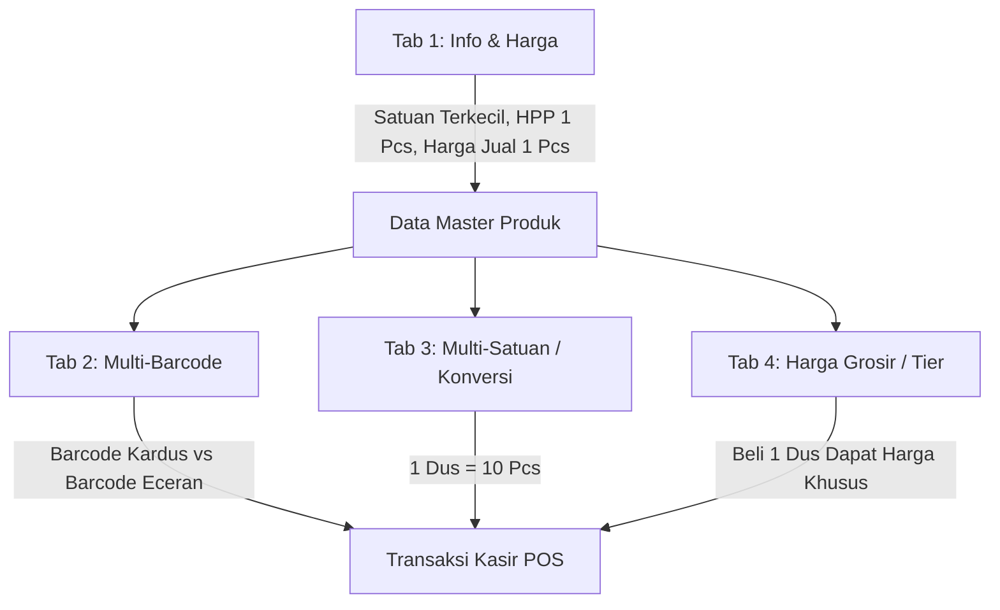

# Panduan Pengisian Master Produk & Multi-Satuan (Konversi, Barcode, & Harga Grosir)

Dokumen ini menjelaskan tata cara pengisian data master produk pada sistem POS Retail Pro, khususnya untuk produk yang memiliki lebih dari satu jenis satuan penjualan (misalnya dapat dijual eceran per **Pcs** maupun per **Dus / Karton / Pak**).

---

## 1. Prinsip Utama: Satuan Dasar Selalu Satuan Terkecil

Dalam sistem inventaris dan *Point of Sale* (POS):
1. **Satuan Terkecil (Base Unit)** adalah fondasi pencatatan stok fisik di database.
2. Semua mutasi stok (masuk, keluar, opname, transfer, retur, dan penjualan kasir) dihitung dan dikonversi ke **Satuan Terkecil**.
3. **Harga Modal (HPP)** dan **Harga Jual Standar** pada halaman utama produk **selalu mengacu pada 1 unit Satuan Terkecil**.

---

## 2. Struktur Pengisian Tab Form Produk

Formulir Produk terbagi ke dalam 4 tab terstruktur:

---

## 3. Studi Kasus Nyata: Beng-Beng Coklat

### Spesifikasi Produk Contoh:
* **Nama Barang**: Beng-Beng Coklat 25g
* **Kemasan Kardus**: 1 Dus berisi 10 Pcs
* **Harga Beli Modal**: Rp 20.000 per Dus
* **Harga Jual Eceran Kasir**: Rp 2.500 per Pcs
* **Harga Jual Dus (Promo Grosir)**: Rp 23.000 per Dus *(lebih hemat Rp 2.000 dibandingkan beli eceran 10 pcs)*
* **Barcode Eceran (Bungkus Kecil)**: `8991234567890`
* **Barcode Kardus (Dus Luar)**: `8991234567999`

---

### Langkah Pengisian Tiap Tab:

### **TAB 1: Info & Harga (Data Dasar 1 Pcs)**

| Field | Nilai Pengisian | Keterangan |
| :--- | :--- | :--- |
| **Nama Produk** | `Beng-Beng Coklat 25g` | Nama lengkap produk |
| **Tipe Produk** | `Standard / Retail` | Jenis item dagangan |
| **Kategori Produk** | `Makanan Ringan` / `Snack` | Klasifikasi kategori barang |
| **Satuan Terkecil** | **`Pcs`** (atau `Bungkus`) | **Wajib satuan terkecil** |
| **Harga Beli (HPP)** | **`2000`** | Didapat dari `Rp 20.000 (harga dus) ÷ 10 pcs = Rp 2.000/pcs` |
| **Harga Jual** | **`2500`** | Harga jual eceran standar per 1 Pcs |
| **Barcode EAN-13** | `8991234567890` | Barcode pada bungkus kecil eceran |
| **Min. Stok Peringatan** | `10` | Batas notifikasi jika stok sisa &le; 10 Pcs |

---

### **TAB 3: Multi-Satuan (Konversi Satuan)**

Tab ini mendefinisikan relasi matematis antara satuan besar (Dus) dengan satuan dasar (Pcs).

1. Klik tombol **"Tambah"**
2. Isi kolom konfigurasi:
   * **1 Satuan Besar (Dari)**: Pilih **`Dus`**
   * **Isi / Rasio**: Ketik **`10`**
   * **Satuan Dasar (Ke)**: Pilih **`Pcs`**

> **Otomatisasi Sistem:**  
> Ketika konversi disimpan, sistem secara internal membuat daftar harga turunan:
> * **HPP 1 Dus** = `10 × Rp 2.000` = **Rp 20.000**
> * **Harga Jual Standar 1 Dus** = `10 × Rp 2.500` = **Rp 25.000**

---

### **TAB 4: Harga Grosir / Tier (Harga Khusus Beli Dus)**

Gunakan tab ini jika pembelian 1 Dus memiliki harga khusus yang lebih murah daripada harga eceran dikali 10:

1. Klik tombol **"Tambah Tier"**
2. Isi kolom tier:
   * **Satuan Jual**: Pilih **`Dus`**
   * **Target Member**: `Semua Pelanggan (Umum)` *(atau pilih grup pelanggan tertentu seperti Agen / Reseller)*
   * **Rentang Qty (Min - Max)**: `Min: 1`, `Max: (kosongkan)`
   * **Harga Jual Satuan**: Ketik **`23000`**

---

### **TAB 2: Multi-Barcode (Barcode Khusus Kemasan Dus)**

Gunakan tab ini agar saat kasir memindai barcode kardus dus, sistem langsung mengenali sebagai 1 Dus:

1. Klik tombol **"Tambah"**
2. Isi kolom barcode:
   * **Kode Barcode Scanner**: Ketik / scan `8991234567999` *(barcode kardus)*
   * **Satuan Jual**: Pilih **`Dus`**

---

## 4. Cara Kerja di Halaman Kasir (POS)

Ketika produk ini ditransaksikan oleh kasir:

1. **Kasir Scan Barcode Bungkus Kecil (`8991234567890`)**:
   * Item bertambah: **1 Pcs** Beng-Beng
   * Harga: **Rp 2.500**
   * Pemotongan stok gudang: **-1 Pcs**

2. **Kasir Scan Barcode Kardus (`8991234567999`)**:
   * Item bertambah: **1 Dus** Beng-Beng
   * Harga otomatis: **Rp 23.000** *(karena aturan tier harga Dus aktif)*
   * Pemotongan stok gudang: **-10 Pcs** *(otomatis konversi)*

3. **Kasir Memilih Satuan Secara Manual**:
   * Kasir mencari nama `Beng-Beng` di kasir, lalu dapat mengubah dropdown satuan dari `Pcs` ke `Dus`.
   * Sistem otomatis menghitung harga dan stok sesuai konversi rasio 10.

---

## 5. Ringkasan Checklist Sebelum Simpan

- [x] Satuan dasar dipilih ke satuan paling kecil (`Pcs` / `Bungkus` / `Gram` / `Ml`).
- [x] Harga Beli (HPP) diisi harga modal per **1 satuan terkecil**.
- [x] Harga Jual diisi harga eceran per **1 satuan terkecil**.
- [x] Rasio konversi sudah dimasukkan di Tab Multi-Satuan (`1 Dus = X Pcs`).
- [x] Jika ada diskon/harga paket untuk Dus, sudah diisi di Tab Harga Grosir / Tier.
- [x] Barcode kardus (jika ada) sudah didaftarkan di Tab Multi-Barcode.
