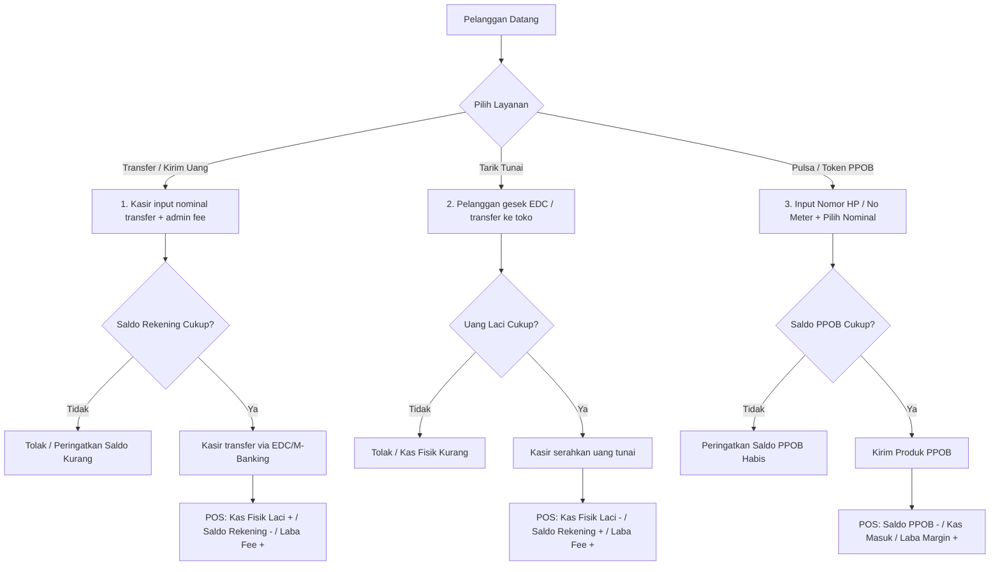
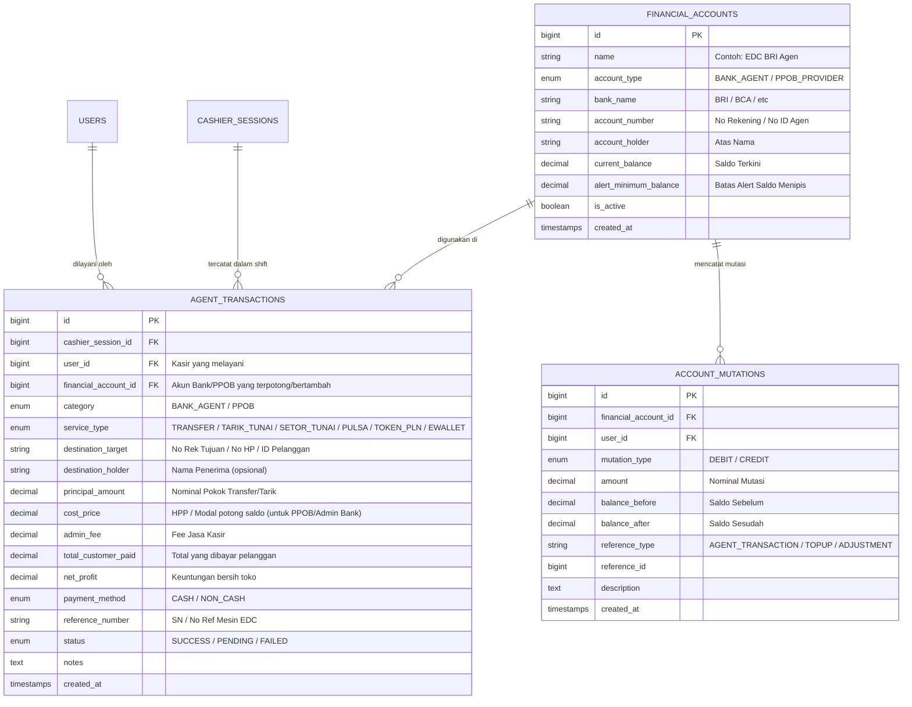

# PRD: Layanan Agen Bank (BRILink) & Produk Digital (PPOB) dengan Multi-Account Balance Management

---

## 1. Executive Summary & Problem Statement

### 1.1 Latar Belakang
Toko retail modern dan kelontong sering kali menjalankan lini bisnis sampingan yang sangat diminati masyarakat sekitar, yaitu:
1. **Layanan Agen Perbankan** (contoh: Agen BRILink, Mandiri Agen, BNI Agen46):
   - Melayani transfer uang antar bank, tarik tunai, dan setor tunai menggunakan mesin EDC atau mobile banking perbankan resmi.
2. **Layanan Produk Digital / PPOB**:
   - Melayani pengisian pulsa, paket data internet, token listrik PLN prabayar, pembayaran tagihan bulanan (BPJS, PDAM, pascabayar), dan top-up e-wallet (Dana, Ovo, ShopeePay, GoPay).

**Tantangan Khusus:**
- Transaksi ini **sangat berbeda dengan penjualan ritel biasa**. Pada penjualan ritel, kasir menerima uang dan stok barang fisik berkurang.
- Pada transaksi agen bank/PPOB:
  - **Uang Pokok BUKAN Omset Toko**: Jika nasabah transfer Rp 1.000.000 dengan biaya admin toko Rp 5.000, total omset toko yang sebenarnya hanyalah Rp 5.000 (pendapatan jasa). Jika Rp 1.000.000 dicatat sebagai omset penjualan barang, laporan laba rugi toko akan rusak dan margin toko terlihat sangat rendah.
  - **Pergeseran Saldo Kas vs Saldo Digital**:
    - **Transfer / Kirim Uang:** Kasir menerima uang fisik tunai di laci (+ Rp 1.005.000), tetapi saldo rekening bank/EDC toko berkurang (- Rp 1.000.000).
    - **Tarik Tunai:** Kasir mengeluarkan uang fisik dari laci (- Rp 500.000), sementara saldo rekening bank/EDC toko bertambah (+ Rp 500.000 atau Rp 505.000).
  - **Multi-Akun & Kebutuhan Cek Saldo**: Toko sering memiliki lebih dari satu rekening bank (misal: Rekening EDC BRI, Rekening BCA Operasional) dan beberapa akun deposit PPOB (misal: Saldo Digiflazz, Saldo Mitra Bukalapak/Tokopedia). Kasir membutuhkan visibilitas cepat terhadap sisa saldo masing-masing akun agar tidak menerima transaksi saat saldo digital tidak mencukupi.

### 1.2 Tujuan (Objectives)
1. **Pemisahan Akuntansi Otomatis**: Memisahkan nilai transaksi pokok (mutasi kas/bank) dari keuntungan toko (fee jasa/margin PPOB).
2. **Multi-Account Balance Tracking**: Menyediakan sistem pencatatan dan pemantauan saldo realtime untuk setiap Rekening Bank Agen dan Saldo Provider PPOB.
3. **Rekonsiliasi Kasir Akurat (Cash Drawer Balancing)**: Menghitung uang fisik laci kasir secara otomatis dengan memperhitungkan cash-in dan cash-out dari layanan transfer dan tarik tunai.
4. **Keamanan & Validasi**: Menolak/memperingatkan kasir jika saldo rekening/PPOB tidak cukup untuk transfer, atau uang fisik laci tidak cukup untuk tarik tunai.

---

## 2. User Persona & Use Cases

### 2.1 Persona
1. **Kasir Toko**:
   - Memeriksa ketersediaan saldo rekening agen dan saldo PPOB langsung dari POS.
   - Menginput transaksi transfer, tarik tunai, dan penjualan pulsa/token.
   - Mencetak struk bukti transaksi keagenan lengkap dengan nomor referensi/SN.
   - Melakukan tutup shift kasir tanpa selisih uang fisik.
2. **Owner / Store Manager**:
   - Memonitor saldo semua akun bank dan saldo PPOB secara terpusat.
   - Melakukan mutasi top up saldo (misal: transfer dana dari bank ke deposit PPOB).
   - Melihat laporan laba bersih khusus dari fee agen & margin PPOB.

### 2.2 Alur Transaksi Utama (Use Cases)

---

## 3. Spesifikasi Fitur (Functional Requirements)

### Fitur 1: Manajemen Akun Finansial (Bank & PPOB Accounts)
1. **Daftar Akun (Financial Accounts Master):**
   - Atribut: Nama Akun (contoh: `EDC BRI Agen Toko`, `Deposit Digiflazz`), Tipe (`BANK_AGENT` atau `PPOB_PROVIDER`), Nomor Rekening/ID, Pemilik Akun, Saldo Terkini, Batas Minimum Saldo (Alert Threshold), Status Aktif.
2. **Pemantauan Saldo Cepat di POS:**
   - Menampilkan saldo terkini di bar navigasi/header POS kasir.
   - Badge status:
     - Hijau: Saldo aman (> threshold).
     - Merah/Kuning: Saldo menipis (kasir harus segera lapor untuk top-up).
3. **Mutasi Antar Akun / Top-up Saldo:**
   - Form pencatatan top-up saldo deposit PPOB menggunakan rekening bank.
   - Contoh: Saldo Rekening BRI berkurang Rp 1.000.000 -> Saldo PPOB Digiflazz bertambah Rp 1.000.000.

### Fitur 2: Layanan Agen Perbankan di POS Kasir
Kasir memiliki tab/modal khusus **[Layanan Agen Bank]**:
1. **Transfer / Kirim Uang (Cash In to Bank):**
   - Kasir memilih rekening asal (misal: Rekening BRI).
   - Kasir input: Bank Tujuan, Nomor Rekening Tujuan, Nama Penerima, Nominal Transfer.
   - Kasir menetapkan Biaya Admin (Fee Kasir): Default otomatis (misal: Rp 5.000) atau custom.
   - Biaya Bank Toko (jika ada potongan saldo oleh bank pengirim, misal Rp 3.000).
   - Hasil:
     - **Kas Laci Kasir:** + (Nominal Transfer + Biaya Admin)
     - **Saldo Bank Toko:** - (Nominal Transfer + Biaya Bank Toko)
     - **Laba Jasa:** + (Biaya Admin - Biaya Bank Toko)
2. **Tarik Tunai (Bank to Cash Out):**
   - Kasir memilih rekening penampung (misal: Rekening BRI EDC).
   - Kasir input: Nominal Tarik Tunai, Biaya Admin Toko (misal: Rp 5.000).
   - Opsi pembayaran admin: Ditambahkan ke tagihan EDC nasabah atau dibayar tunai.
   - Hasil:
     - **Kas Laci Kasir:** - Nominal Tarik Tunai
     - **Saldo Bank Toko:** + (Nominal Tarik Tunai [+ Admin jika gesek])
     - **Laba Jasa:** + Biaya Admin Toko
3. **Setor Tunai ke Rekening Nasabah:**
   - Mirip dengan flow transfer uang.

### Fitur 3: Layanan Pulsa & Produk Digital (PPOB)
1. **Katalog Produk PPOB (Non-Inventory):**
   - Pulsa Reguler, Paket Data, Token PLN, E-Money/E-Wallet, Voucher Game.
   - Harga Beli/HPP (Modal Saldo Terpotong) & Harga Jual Standar Toko.
2. **Transaksi di POS:**
   - Input Nomor HP / ID Pelanggan.
   - Kasir memilih produk & nominal.
   - Sistem memvalidasi ketersediaan saldo PPOB terpilih.
   - Kasir memilih metode bayar (Tunai, QRIS, Transfer).
   - Hasil:
     - **Saldo PPOB:** - Modal/HPP
     - **Kas/Bank:** + Harga Jual
     - **Laba Kotor:** + (Harga Jual - Modal)

### Fitur 4: Rekonsiliasi Kasir & Tutup Shift (End-of-Shift Balancing)
Di modul `CashierSession` (Tutup Kasir):
- Perhitungan Uang Fisik Laci yang Diharapkan:
  $$\text{Kas Ekspektasi} = \text{Modal Awal} + \text{Penjualan Ritel Tunai} + \text{Cash In Agen (Transfer/PPOB)} - \text{Cash Out Agen (Tarik Tunai)}$$
- Ringkasan Mutasi Saldo Digital per Shift:
  - Rekening Bank A: Saldo Awal Shift, Mutasi Masuk (+), Mutasi Keluar (-), Saldo Akhir Shift.
  - Akun PPOB: Saldo Awal Shift, Terpakai (-), Saldo Akhir Shift.
  - Total Keuntungan Layanan Agen & PPOB shift tersebut.

### Fitur 5: Pelaporan & Audit
1. **Laporan Laba Rugi Terpisah:**
   - Menampilkan "Laba Penjualan Ritel" dan "Pendapatan Komisi/Fee Jasa Agen & PPOB" secara terpisah.
2. **Laporan Mutasi Akun:**
   - Buku besar mutasi lengkap per rekening bank dan akun PPOB (waktu, debit, kredit, sisa saldo, ID transaksi, keterangan).

---

## 4. Desain Database & Skema Relasi

---

## 5. Rencana Tahapan Implementasi (Implementation Roadmap)

### Fase 1: Core Foundation & Master Akun
- Migrasi database untuk `financial_accounts`, `agent_transactions`, dan `account_mutations`.
- CRUD Master Akun Finansial (Bank & PPOB) di menu Backoffice/Settings.
- Fitur penyesuaian saldo awal dan mutasi manual / top up saldo.

### Fase 2: Service Layer & Logika Transaksi
- Pembuatan Service Class: `AgentTransactionService` dan `AccountBalanceService`.
- Penanganan kalkulasi otomatis:
  - Transaksi Transfer: Kas laci (+), Saldo bank (-), Fee (+).
  - Transaksi Tarik Tunai: Kas laci (-), Saldo bank (+), Fee (+).
  - Transaksi PPOB: Saldo PPOB (-), Kas laci (+), Margin (+).

### Fase 3: Integrasi POS Kasir (UI/UX)
- Widget Bar Saldo Realtime di header POS (memperlihatkan saldo setiap akun bank & PPOB).
- Modal Kasir: Layanan Agen Bank (Transfer & Tarik Tunai).
- Modal Kasir: Layanan Pulsa & PPOB (Input Nomor Tujuan, Nominal, Cetak SN).
- Struk khusus transaksi agen/PPOB (thermal printer 58mm / 80mm).

### Fase 4: Integrasi Tutup Kasir & Laporan
- Penyesuaian kalkulasi `CashierSession`: Rekap cash in / cash out ke laci kasir.
- Laporan Mutasi Saldo & Laporan Laba Bersih Fee Agen di Backoffice.

---

## 6. Todo List & Task Breakdown

### Database & Backend Models
- [x] Buat migration tabel `agent_transactions` & penyesuaian schema `accounts` (support multi-account `bank_agent` & `ppob_provider`)
- [x] Buat migration tabel `account_mutations` (pencatatan audit trail saldo setiap akun)
- [x] Tambah relasi & field rekap transaksi agen di `cashier_shifts`
- [x] Update model `Account` dengan method helper saldo (`isLowBalance()`, `isBankAgent()`, `isPpobProvider()`)
- [x] Buat model `AgentTransaction` dan relasi ke `CashierShift`, `User`, dan `Account`
- [x] Buat model `AccountMutation`
- [x] Buat & jalankan Seeder akun contoh (`FinancialAccountSeeder`: Kas Laci, Rekening BCA, EDC Agen BRILink, Deposit PPOB Digiflazz)

### Business Logic (Services)
- [x] Buat `AccountBalanceService`:
  - [x] Method `credit()` dan `debit()` saldo akun secara atomic (DB transaction & lockForUpdate)
  - [x] Method `transferBetweenAccounts()` untuk pencatatan top up saldo PPOB dari Bank
  - [x] Pengecekan `hasSufficientBalance()` & `getAccountsSummary()`
- [x] Buat `AgentTransactionService`:
  - [x] Logika transaksi Transfer Bank (potong saldo bank, terima uang cash, catat profit fee)
  - [x] Logika transaksi Tarik Tunai (potong kas fisik laci, tambah saldo bank, catat profit fee)
  - [x] Logika transaksi Pulsa / PPOB (potong saldo PPOB, terima uang cash/non-cash, catat laba)
- [x] Update `CashierShift` & Controller:
  - [x] Rekap otomatis kas masuk agen (`total_agent_cash_in`), kas keluar agen (`total_agent_cash_out`), dan laba agen (`total_agent_profit`) ke saldo fisik kasir (`expected_cash`)

### UI & Komponen Kasir (POS)
- [x] Komponen **Header Saldo Widget**:
  - [x] Menampilkan chip saldo bank agen & saldo PPOB
  - [x] Popover detail semua akun yang aktif
- [x] Modal Transaksi **Agen Perbankan**:
  - [x] Form Transfer (Pilih Akun Sumber, Bank Tujuan, No Rek, Nominal, Fee Toko)
  - [x] Form Tarik Tunai (Pilih Akun Penampung, Nominal, Fee Toko)
  - [x] Validasi kecukupan saldo bank dan uang laci
- [x] Modal Transaksi **Pulsa & PPOB**:
  - [x] Pilihan operator / jenis layanan
  - [x] Input nomor tujuan & nomor seri (SN)
- [x] Template Struk Cetak Transaksi Agen / PPOB (Thermal 58mm / 80mm preview & print)

### Backoffice & Reporting
- [x] Menu Master Akun Finansial (Tambah/Edit rekening & provider PPOB, alert threshold saldo minimum)
- [x] Form Mutasi Top Up / Penyesuaian Saldo (Terintegrasi via Transfer Kas/Bank dengan pencatatan audit mutation trail)
- [x] Laporan Khusus Fee & Keuntungan Layanan Agen / PPOB (Card KPI & breakdown per shift di Rekap Shift Kasir)
- [x] Laporan Riwayat Mutasi Saldo Digital & audit mutasi rekening

### Testing & Verifikasi
- [x] Unit Test kalkulasi mutasi saldo (`credit`/`debit`) dan proteksi saldo minus
- [x] Feature Test transaksi Transfer di POS dan efeknya ke laci kasir
- [x] Feature Test transaksi Tarik Tunai di POS dan efeknya ke laci kasir
- [x] Test Tutup Shift Kasir dengan transaksi kombinasi (Ritel + Agen Bank + PPOB)

