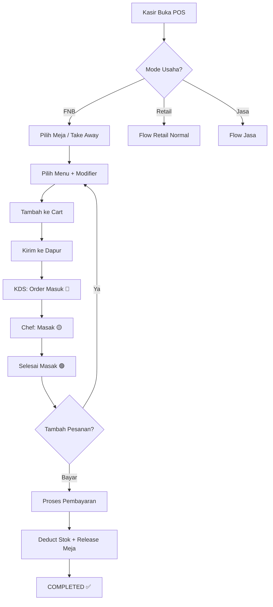
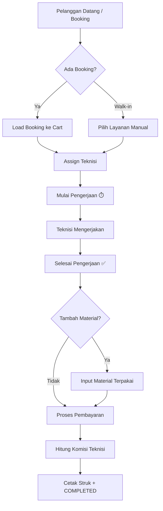

# Dukungan Multi Jenis Usaha: Retail + FNB + Jasa

## Latar Belakang

Aplikasi POS saat ini didesain untuk **retail/ritel**. Plan ini memperluas dukungan menjadi **3 jenis usaha**:

1. **Retail** — Sudah ada dan berjalan penuh
2. **FNB (Food & Beverage)** — Restoran, kafe, kedai minuman
3. **Jasa (Service)** — Salon, barbershop, laundry, bengkel, cuci mobil, spa, klinik kecantikan, dsb.

### Analisis Gap: Retail vs FNB vs Jasa

| Aspek | Retail (Saat Ini) | FNB (Baru) | Jasa (Baru) |
|-------|-------------------|------------|-------------|
| **Produk** | Barang fisik + barcode | Menu + modifiers | Layanan/jasa + durasi |
| **Stok** | Tracking per item (FIFO) | Tracking bahan baku (resep) | Opsional (material terpakai) |
| **Penjualan** | 1x transaksi langsung selesai | Order → dapur → served → bayar | Booking → dikerjakan → selesai → bayar |
| **Meja** | Tidak ada | Manajemen meja + reservasi | Tidak ada |
| **Antrian** | Tidak ada | Nomor antrian (take away) | Antrian pelanggan |
| **Pekerja** | Kasir saja | Kasir + pelayan + chef | Kasir + teknisi/terapis |
| **Durasi** | Tidak ada | Estimasi waktu masak | Durasi layanan (30 menit, 1 jam) |
| **Booking** | Tidak ada | Reservasi meja | Appointment/jadwal booking |
| **Modifier** | Tidak ada | Topping, level pedas, ukuran | Varian layanan (extra deep clean, premium) |
| **Cetak** | 1 struk kasir | Struk + tiket dapur | Struk + nota layanan |
| **Status Order** | Langsung `completed` | `new` → `preparing` → `ready` → `served` | `booked` → `in_progress` → `completed` |

---

## Keputusan Desain (Sudah Dijawab)

| Keputusan | Jawaban |
|-----------|---------|
| Integrasi Delivery (GrabFood/GoFood) | ❌ Tidak perlu, cukup Dine-in & Take Away |
| Reservasi Meja | ✅ Ya, perlu reservasi lengkap (tanggal, jam, nama, jumlah tamu) |
| KDS Update Method | 🔄 Auto-refresh berkala (simple, tanpa WebSocket) |
| Nomor Antrian | ✅ Ya, perlu nomor antrian otomatis (A-001, reset harian) |

---

## Proposed Changes

Perubahan dibagi menjadi **10 komponen utama**:

- **Komponen 1-7**: Fitur FNB
- **Komponen 8-10**: Fitur Jasa

---

### Komponen 1: Business Type Setting & Configuration

Menambahkan konfigurasi jenis usaha sehingga fitur FNB/Jasa bisa di-toggle.

#### [MODIFY] [SettingController.php](file:///Users/mac/Adam%20Adifa/Project/poslaravel/app/Http/Controllers/SettingController.php)

- Tambah method `updateBusinessType()` untuk menyimpan setting:
  - `business_type` → `retail` | `fnb` | `service` | `hybrid`
  - **FNB Settings:**
    - `fnb_enable_table_management` → boolean
    - `fnb_enable_kitchen_display` → boolean
    - `fnb_enable_modifiers` → boolean
    - `fnb_enable_reservation` → boolean
    - `fnb_default_service_type` → `dine_in` | `take_away`
    - `fnb_service_charge_percent` → decimal (0-100)
    - `fnb_auto_print_kitchen_ticket` → boolean
    - `fnb_enable_queue_number` → boolean
  - **Jasa Settings:**
    - `service_enable_booking` → boolean
    - `service_enable_technician_assignment` → boolean
    - `service_enable_duration_tracking` → boolean
    - `service_booking_slot_minutes` → integer (15, 30, 60)
    - `service_auto_queue` → boolean
    - `service_enable_material_usage` → boolean (tracking material/bahan terpakai)

#### [MODIFY] [index.blade.php (settings)](file:///Users/mac/Adam%20Adifa/Project/poslaravel/resources/views/settings/index.blade.php)

- Tambah tab **"Jenis Usaha"** di halaman settings:
  - Radio selector: Retail / FNB / Jasa / Hybrid
  - Sub-panel FNB settings (muncul jika FNB atau Hybrid)
  - Sub-panel Jasa settings (muncul jika Jasa atau Hybrid)

#### [MODIFY] [web.php](file:///Users/mac/Adam%20Adifa/Project/poslaravel/routes/web.php)

- Tambah route `POST settings/business-type`

---

### Komponen 2: Table Management (Manajemen Meja) — FNB

#### [NEW] [2026_09_14_010000_create_fnb_tables.php](file:///Users/mac/Adam%20Adifa/Project/poslaravel/database/migrations/2026_09_14_010000_create_fnb_tables.php)

Tabel `dining_tables`:
```
- id
- warehouse_id (FK → warehouses, meja terikat outlet)
- table_number (string, "M01", "VIP-1")
- area (string, "Indoor", "Outdoor", "Rooftop", "VIP Room")
- capacity (integer, jumlah kursi)
- status (enum: 'available', 'occupied', 'reserved', 'maintenance')
- current_sale_id (FK → sales, nullable)
- sort_order, is_active, timestamps
```

Tabel `table_merges` (gabung meja):
```
- id
- primary_table_id, merged_table_id (FK → dining_tables)
- sale_id (FK → sales)
- merged_at, unmerged_at (datetime)
```

Tabel `table_reservations` (reservasi meja):
```
- id
- dining_table_id (FK → dining_tables)
- warehouse_id (FK → warehouses)
- customer_id (FK → customers, nullable)
- guest_name (string)
- guest_phone (string, nullable)
- guest_count (integer)
- reservation_date (date)
- reservation_time (time)
- duration_minutes (integer, default 120)
- status (enum: 'pending', 'confirmed', 'seated', 'completed', 'cancelled', 'no_show')
- notes (text, nullable)
- created_by (FK → users)
- timestamps
```

#### [NEW] [DiningTable.php](file:///Users/mac/Adam%20Adifa/Project/poslaravel/app/Models/DiningTable.php)
#### [NEW] [TableMerge.php](file:///Users/mac/Adam%20Adifa/Project/poslaravel/app/Models/TableMerge.php)
#### [NEW] [TableReservation.php](file:///Users/mac/Adam%20Adifa/Project/poslaravel/app/Models/TableReservation.php)

#### [NEW] [DiningTableController.php](file:///Users/mac/Adam%20Adifa/Project/poslaravel/app/Http/Controllers/DiningTableController.php)

- CRUD meja (master data)
- API status meja real-time
- Occupy / release meja
- Merge / unmerge meja
- CRUD reservasi meja
- API: cek ketersediaan meja berdasarkan tanggal + jam
- Auto: ubah status meja ke `reserved` saat ada reservasi mendekati waktunya

#### [NEW] [resources/views/dining-tables/](file:///Users/mac/Adam%20Adifa/Project/poslaravel/resources/views/dining-tables/)

- `index.blade.php` — CRUD meja (master data tabel)
- `floor-plan.blade.php` — Visual floor plan (layout meja, status warna-warni)
- `reservations.blade.php` — Daftar & kelola reservasi (kalender view + list view)

---

### Komponen 3: Menu Modifiers & Add-Ons — FNB

#### [NEW] [2026_09_14_020000_create_fnb_modifiers_tables.php](file:///Users/mac/Adam%20Adifa/Project/poslaravel/database/migrations/2026_09_14_020000_create_fnb_modifiers_tables.php)

Tabel `modifier_groups`:
```
- id
- name (string, "Level Pedas", "Topping", "Ukuran", "Level Gula")
- selection_type (enum: 'single', 'multiple')
- is_required (boolean)
- min_selections, max_selections (integer)
- sort_order, is_active, timestamps
```

Tabel `modifiers` (opsi dalam grup):
```
- id
- modifier_group_id (FK)
- name (string, "Level 1", "Extra Keju", "Upsize Large")
- price_adjustment (decimal, 0 = gratis, 5000 = +5rb)
- is_default (boolean)
- sort_order, is_active, timestamps
```

Tabel `product_modifier_groups` (pivot produk ↔ modifier group):
```
- product_id (FK), modifier_group_id (FK), sort_order
```

Tabel `sale_item_modifiers` (modifier terpilih per item transaksi):
```
- id
- sale_item_id (FK → sale_items)
- modifier_id (FK → modifiers)
- modifier_name, price_adjustment (snapshot)
- timestamps
```

#### [NEW] [ModifierGroup.php](file:///Users/mac/Adam%20Adifa/Project/poslaravel/app/Models/ModifierGroup.php)
#### [NEW] [Modifier.php](file:///Users/mac/Adam%20Adifa/Project/poslaravel/app/Models/Modifier.php)
#### [NEW] [SaleItemModifier.php](file:///Users/mac/Adam%20Adifa/Project/poslaravel/app/Models/SaleItemModifier.php)

#### [NEW] [ModifierController.php](file:///Users/mac/Adam%20Adifa/Project/poslaravel/app/Http/Controllers/ModifierController.php)

- CRUD Modifier Groups + child Modifiers
- Assign modifier groups ke produk

#### [NEW] [resources/views/modifiers/index.blade.php](file:///Users/mac/Adam%20Adifa/Project/poslaravel/resources/views/modifiers/index.blade.php)

#### [MODIFY] [Product.php](file:///Users/mac/Adam%20Adifa/Project/poslaravel/app/Models/Product.php)

- Tambah relationship `modifierGroups()` (BelongsToMany)
- Tambah field `product_type` ke fillable: `standard` | `food` | `beverage` | `combo` | `service`

#### [MODIFY] [SaleItem.php](file:///Users/mac/Adam%20Adifa/Project/poslaravel/app/Models/SaleItem.php)

- Tambah relationship `modifiers()` (HasMany → SaleItemModifier)
- Tambah field `notes` ke fillable

---

### Komponen 4: Order Management, Queue Number & Kitchen Flow — FNB

#### [NEW] [2026_09_14_030000_add_fnb_columns_to_sales_tables.php](file:///Users/mac/Adam%20Adifa/Project/poslaravel/database/migrations/2026_09_14_030000_add_fnb_columns_to_sales_tables.php)

Tambah kolom ke tabel `sales`:
```
- service_type (enum: 'dine_in', 'take_away', nullable)
- dining_table_id (FK → dining_tables, nullable)
- queue_number (string, nullable, "A-001")
- order_status (enum: 'new_order', 'preparing', 'ready', 'served', 'completed', nullable)
- guest_count (integer, nullable)
- service_charge (decimal, nullable)
- waiter_id (FK → users, nullable)
```

Tambah kolom ke tabel `sale_items`:
```
- notes (text, nullable, "no onion", "extra sambal")
- item_status (enum: 'pending', 'preparing', 'ready', 'served', nullable)
- prepared_at, served_at (datetime, nullable)
```

Tabel `queue_counters` (counter nomor antrian harian):
```
- id
- warehouse_id (FK → warehouses)
- counter_date (date)
- prefix (string, "A")
- last_number (integer, default 0)
- timestamps
- unique: [warehouse_id, counter_date, prefix]
```

#### [MODIFY] [Sale.php](file:///Users/mac/Adam%20Adifa/Project/poslaravel/app/Models/Sale.php)

- Tambah field FNB baru ke `$fillable` dan `$casts`
- Tambah relationships: `diningTable()`, `waiter()`

#### [NEW] [QueueCounter.php](file:///Users/mac/Adam%20Adifa/Project/poslaravel/app/Models/QueueCounter.php)

#### [NEW] [OrderService.php](file:///Users/mac/Adam%20Adifa/Project/poslaravel/app/Services/OrderService.php)

- `createOrder()` — buat order FNB (beda flow dari retail)
- `addItemsToOrder()` — tambah item ke order yang sudah berjalan
- `updateItemStatus()` — update status item (preparing → ready)
- `updateOrderStatus()` — update status order keseluruhan
- `moveTable()` — pindah meja
- `splitBill()` — split tagihan
- `mergeBill()` — gabung tagihan
- `generateQueueNumber()` — generate nomor antrian (A-001, reset harian per outlet)
- `completeOrder()` — finalisasi order

#### [MODIFY] [SaleService.php](file:///Users/mac/Adam%20Adifa/Project/poslaravel/app/Services/SaleService.php)

- Modifikasi `processSale()` untuk handle mode FNB:
  - Support modifier price adjustments
  - Set `dining_table_id` dan update status meja
  - Generate `queue_number` jika take away
  - FNB: simpan order dulu (`order_status: new_order`), bayar nanti

---

### Komponen 5: Kitchen Display System (KDS) — FNB

#### [NEW] [KitchenController.php](file:///Users/mac/Adam%20Adifa/Project/poslaravel/app/Http/Controllers/KitchenController.php)

- `index()` — halaman KDS fullscreen
- `getActiveOrders()` — API: ambil order yang `new_order` atau `preparing`
- `markItemPreparing()` / `markItemReady()` — update status per item
- `markOrderReady()` — set seluruh order ready
- `bumpOrder()` — selesaikan order dari KDS

#### [NEW] [resources/views/kitchen/index.blade.php](file:///Users/mac/Adam%20Adifa/Project/poslaravel/resources/views/kitchen/index.blade.php)

Layout fullscreen KDS:
- Card per order: nomor meja/antrian, item list + modifier + catatan, waktu tunggu
- Warna status: 🔴 baru masuk, 🟡 diproses, 🟢 siap
- Timer per order (elapsed time)
- Auto-refresh setiap 5-10 detik
- Sound notification order baru
- Filter: semua / makanan / minuman (untuk dapur vs bar terpisah)
- **Tampilan nomor antrian besar** untuk take away

---

### Komponen 6: Modifikasi POS UI untuk Mode FNB

#### [MODIFY] [index.blade.php (POS)](file:///Users/mac/Adam%20Adifa/Project/poslaravel/resources/views/pos/index.blade.php)

Perubahan kondisional (hanya muncul jika FNB/Hybrid):

1. **Table Selector** — Pilih meja sebelum order (visual grid + status)
2. **Service Type Toggle** — Dine-in | Take Away
3. **Modifier Modal** — Modal pilih modifier saat klik produk FNB
4. **Item Notes** — Input catatan per item di cart
5. **Guest Count** — Input jumlah tamu
6. **Queue Number Display** — Nomor antrian di cart header (take away)
7. **"Kirim ke Dapur"** — Tombol kirim order ke kitchen
8. **"Tambah Pesanan"** — Tambah item ke order yang berjalan
9. **"Print Tiket Dapur"** — Print tiket dapur manual
10. **Bill Preview** — Preview bill sebelum bayar (dine-in)

#### [NEW] [_table_selector_modal.blade.php](file:///Users/mac/Adam%20Adifa/Project/poslaravel/resources/views/pos/_table_selector_modal.blade.php)

- Grid visual meja dengan status warna + info reservasi
- Filter per area

#### [NEW] [_modifier_modal.blade.php](file:///Users/mac/Adam%20Adifa/Project/poslaravel/resources/views/pos/_modifier_modal.blade.php)

- Pilihan modifier (single/multi select)
- Price adjustment preview
- Input catatan item

#### [MODIFY] [PosController.php](file:///Users/mac/Adam%20Adifa/Project/poslaravel/app/Http/Controllers/PosController.php)

- Load data meja, modifiers, dan reservasi jika mode FNB
- Endpoint baru: `createOrder()`, `addToOrder()`, `sendToKitchen()`, `getTableStatus()`

---

### Komponen 7: Recipe/BOM (Opsional/Future) — FNB

> [!NOTE]
> Komponen ini **opsional** untuk fase awal. Tanpa ini, stok FNB tetap bisa di-track manual. Dengan ini, stok bahan baku otomatis berkurang sesuai resep.

#### [NEW] [2026_09_14_040000_create_recipes_tables.php](file:///Users/mac/Adam%20Adifa/Project/poslaravel/database/migrations/2026_09_14_040000_create_recipes_tables.php)

Tabel `recipes`:
```
- id, product_id (FK, menu FNB), ingredient_product_id (FK, bahan baku)
- quantity_needed (decimal), unit_id (FK), waste_percent (decimal)
- notes, timestamps
```

#### [NEW] [Recipe.php](file:///Users/mac/Adam%20Adifa/Project/poslaravel/app/Models/Recipe.php)
#### [NEW] [RecipeController.php](file:///Users/mac/Adam%20Adifa/Project/poslaravel/app/Http/Controllers/RecipeController.php)

---

### Komponen 8: Service Items & Produk Jasa — Jasa

Menambahkan tipe produk "jasa/service" yang tidak memiliki stok fisik, tapi punya durasi dan bisa di-assign ke teknisi/staff.

#### [NEW] [2026_09_14_050000_create_service_tables.php](file:///Users/mac/Adam%20Adifa/Project/poslaravel/database/migrations/2026_09_14_050000_create_service_tables.php)

Tambah kolom ke tabel `products` (via ALTER):
```
- product_type (enum: 'standard', 'food', 'beverage', 'combo', 'service', default 'standard')
- duration_minutes (integer, nullable, durasi layanan: 30, 60, 90 menit)
- is_bookable (boolean, default false, apakah bisa di-booking online)
- require_staff_assignment (boolean, default false)
- max_concurrent (integer, nullable, maks pengerjaan bersamaan)
```

Tabel `service_staff` (pivot user ↔ service, staff mana yang bisa mengerjakan jasa apa):
```
- id
- user_id (FK → users, teknisi/terapis/tukang)
- product_id (FK → products, layanan yang bisa dikerjakan)
- commission_type (enum: 'none', 'fixed', 'percent')
- commission_value (decimal, default 0)
- is_active (boolean)
- timestamps
```

Tabel `sale_item_assignments` (assignment teknisi per item transaksi):
```
- id
- sale_item_id (FK → sale_items)
- staff_user_id (FK → users, teknisi yang mengerjakan)
- status (enum: 'assigned', 'in_progress', 'completed', 'cancelled')
- started_at (datetime, nullable)
- completed_at (datetime, nullable)
- duration_actual_minutes (integer, nullable)
- commission_amount (decimal, default 0)
- notes (text, nullable)
- timestamps
```

#### [NEW] [ServiceStaff.php](file:///Users/mac/Adam%20Adifa/Project/poslaravel/app/Models/ServiceStaff.php)
#### [NEW] [SaleItemAssignment.php](file:///Users/mac/Adam%20Adifa/Project/poslaravel/app/Models/SaleItemAssignment.php)

#### [MODIFY] [Product.php](file:///Users/mac/Adam%20Adifa/Project/poslaravel/app/Models/Product.php)

- Tambah fields baru ke `$fillable`: `product_type`, `duration_minutes`, `is_bookable`, `require_staff_assignment`, `max_concurrent`
- Tambah relationship `serviceStaff()` (HasMany)
- Tambah scope `scopeServices()` — filter produk tipe `service`

#### [MODIFY] [SaleItem.php](file:///Users/mac/Adam%20Adifa/Project/poslaravel/app/Models/SaleItem.php)

- Tambah relationship `assignment()` (HasOne → SaleItemAssignment)

#### [NEW] [ServiceStaffController.php](file:///Users/mac/Adam%20Adifa/Project/poslaravel/app/Http/Controllers/ServiceStaffController.php)

- CRUD: assign staff ke layanan + set komisi
- API: `getAvailableStaff()` — daftar staff yang available (tidak sedang mengerjakan jasa lain)

#### [MODIFY] [ProductController.php](file:///Users/mac/Adam%20Adifa/Project/poslaravel/app/Http/Controllers/ProductController.php)

- Form produk: tambah tab/section untuk setting jasa (durasi, bookable, assignment, staff)
- Conditional fields: muncul hanya jika `product_type` = `service`

#### [NEW] [resources/views/service-staff/index.blade.php](file:///Users/mac/Adam%20Adifa/Project/poslaravel/resources/views/service-staff/index.blade.php)

- Daftar staff + layanan yang bisa dikerjakan + setting komisi

---

### Komponen 9: Booking & Appointment — Jasa

Sistem booking/appointment untuk pelanggan memesan layanan di waktu tertentu.

#### [NEW] [2026_09_14_060000_create_service_bookings_table.php](file:///Users/mac/Adam%20Adifa/Project/poslaravel/database/migrations/2026_09_14_060000_create_service_bookings_table.php)

Tabel `service_bookings`:
```
- id
- booking_number (string, unique, "BK-2026-09-001")
- warehouse_id (FK → warehouses, outlet)
- customer_id (FK → customers, nullable)
- guest_name (string, nama pelanggan walk-in)
- guest_phone (string, nullable)
- booking_date (date)
- booking_time (time)
- estimated_duration_minutes (integer, total durasi semua layanan)
- status (enum: 'pending', 'confirmed', 'in_progress', 'completed', 'cancelled', 'no_show')
- sale_id (FK → sales, nullable, terhubung ke transaksi saat checkout)
- notes (text, nullable)
- created_by (FK → users)
- timestamps
```

Tabel `service_booking_items` (layanan yang dipesan):
```
- id
- service_booking_id (FK)
- product_id (FK → products, layanan)
- staff_user_id (FK → users, nullable, teknisi yang diminta)
- quantity (integer, default 1)
- unit_price (decimal)
- notes (text, nullable)
- timestamps
```

#### [NEW] [ServiceBooking.php](file:///Users/mac/Adam%20Adifa/Project/poslaravel/app/Models/ServiceBooking.php)
#### [NEW] [ServiceBookingItem.php](file:///Users/mac/Adam%20Adifa/Project/poslaravel/app/Models/ServiceBookingItem.php)

#### [NEW] [ServiceBookingController.php](file:///Users/mac/Adam%20Adifa/Project/poslaravel/app/Http/Controllers/ServiceBookingController.php)

- CRUD booking: buat, edit, batalkan
- `index()` — halaman daftar booking (tabel + filter tanggal + status + staff)
- `calendar()` — tampilan kalender booking (daily/weekly view)
- `checkAvailability()` — API: cek slot waktu yang tersedia berdasarkan tanggal + staff
- `convertToSale()` — konversi booking menjadi transaksi penjualan
- `generateBookingNumber()` — auto generate nomor booking

#### [NEW] [resources/views/service-bookings/](file:///Users/mac/Adam%20Adifa/Project/poslaravel/resources/views/service-bookings/)

- `index.blade.php` — Daftar booking (tabel + filter)
- `calendar.blade.php` — Kalender booking harian/mingguan (timeline per staff)
- `_create_modal.blade.php` — Modal buat booking baru

---

### Komponen 10: Service Queue, Tracking & POS Mode Jasa

#### [NEW] [2026_09_14_070000_add_service_columns_to_sales_tables.php](file:///Users/mac/Adam%20Adifa/Project/poslaravel/database/migrations/2026_09_14_070000_add_service_columns_to_sales_tables.php)

Tambah kolom ke tabel `sales`:
```
- service_booking_id (FK → service_bookings, nullable)
- assigned_staff_id (FK → users, nullable, teknisi utama)
- service_status (enum: 'waiting', 'in_progress', 'completed', nullable)
- service_started_at (datetime, nullable)
- service_completed_at (datetime, nullable)
```

#### [NEW] [ServiceService.php](file:///Users/mac/Adam%20Adifa/Project/poslaravel/app/Services/ServiceService.php)

- `createServiceOrder()` — buat order jasa (dari booking atau walk-in)
- `assignStaff()` — assign teknisi ke order
- `startService()` — mulai pengerjaan (catat waktu mulai)
- `completeService()` — selesai pengerjaan (catat waktu selesai, hitung durasi aktual)
- `calculateCommission()` — hitung komisi teknisi berdasarkan layanan yang dikerjakan
- `getServiceQueue()` — antrian layanan hari ini per outlet
- `trackMaterialUsage()` — catat material/bahan yang dipakai (opsional)

#### [NEW] [ServiceQueueController.php](file:///Users/mac/Adam%20Adifa/Project/poslaravel/app/Http/Controllers/ServiceQueueController.php)

- `index()` — halaman antrian layanan (mirip KDS tapi untuk jasa)
- `getActiveServices()` — API: layanan yang sedang dikerjakan + antrian
- `startService()` — mulai pengerjakan
- `completeService()` — selesai
- `dashboard()` — dashboard staff/teknisi: lihat antrian, mulai/selesai jasa

#### [NEW] [resources/views/service-queue/](file:///Users/mac/Adam%20Adifa/Project/poslaravel/resources/views/service-queue/)

- `index.blade.php` — Antrian layanan (fullscreen dashboard):
  - Panel kiri: antrian menunggu (card per customer + layanan yang dipesan)
  - Panel tengah: sedang dikerjakan (per teknisi, timer berjalan)
  - Panel kanan: selesai hari ini
  - Auto-refresh setiap 10 detik

#### [MODIFY] [POS UI (index.blade.php)](file:///Users/mac/Adam%20Adifa/Project/poslaravel/resources/views/pos/index.blade.php)

Perubahan kondisional untuk mode Jasa:

1. **Staff Assignment** — Pilih teknisi/terapis saat tambah item jasa ke cart
2. **Duration Display** — Tampilkan estimasi durasi per item
3. **Booking Integration** — Tombol "Load Booking" untuk import booking ke cart
4. **Material Usage** — Input material/bahan yang dipakai (opsional)
5. **"Mulai Pengerjaan"** — Tombol mulai service (catat waktu mulai)
6. **Commission Preview** — Preview komisi teknisi sebelum checkout

#### [MODIFY] [PosController.php](file:///Users/mac/Adam%20Adifa/Project/poslaravel/app/Http/Controllers/PosController.php)

- Load data staff dan booking jika mode Jasa
- Endpoint: `createServiceOrder()`, `loadBooking()`, `getAvailableStaff()`

#### [NEW] [_staff_selector_modal.blade.php](file:///Users/mac/Adam%20Adifa/Project/poslaravel/resources/views/pos/_staff_selector_modal.blade.php)

- Modal pilih teknisi/terapis (foto, nama, status available/busy)
- Filter per keahlian/layanan

---

## Diagram Alur FNB Order



## Diagram Alur Jasa/Service Order



---

## Struktur File Baru (Ringkasan Lengkap)

```
app/
├── Http/Controllers/
│   ├── DiningTableController.php       [NEW] — FNB: CRUD meja + reservasi
│   ├── ModifierController.php          [NEW] — FNB: CRUD modifier
│   ├── KitchenController.php           [NEW] — FNB: Kitchen Display System
│   ├── RecipeController.php            [NEW] — FNB: Resep/BOM (opsional)
│   ├── ServiceStaffController.php      [NEW] — Jasa: staff assignment + komisi
│   ├── ServiceBookingController.php    [NEW] — Jasa: booking/appointment
│   ├── ServiceQueueController.php      [NEW] — Jasa: antrian & tracking
│   ├── PosController.php              [MODIFY]
│   ├── ProductController.php          [MODIFY]
│   ├── SettingController.php          [MODIFY]
│   └── ...
├── Models/
│   ├── DiningTable.php                [NEW] — FNB
│   ├── TableMerge.php                 [NEW] — FNB
│   ├── TableReservation.php           [NEW] — FNB
│   ├── ModifierGroup.php              [NEW] — FNB
│   ├── Modifier.php                   [NEW] — FNB
│   ├── SaleItemModifier.php           [NEW] — FNB
│   ├── QueueCounter.php               [NEW] — FNB
│   ├── Recipe.php                     [NEW] — FNB (opsional)
│   ├── ServiceStaff.php               [NEW] — Jasa
│   ├── SaleItemAssignment.php         [NEW] — Jasa
│   ├── ServiceBooking.php             [NEW] — Jasa
│   ├── ServiceBookingItem.php         [NEW] — Jasa
│   ├── Product.php                    [MODIFY]
│   ├── Sale.php                       [MODIFY]
│   ├── SaleItem.php                   [MODIFY]
│   └── ...
├── Services/
│   ├── OrderService.php               [NEW] — FNB
│   ├── ServiceService.php             [NEW] — Jasa
│   ├── SaleService.php                [MODIFY]
│   └── ...
database/migrations/
│   ├── 2026_09_14_010000_create_fnb_tables.php                [NEW]
│   ├── 2026_09_14_020000_create_fnb_modifiers_tables.php      [NEW]
│   ├── 2026_09_14_030000_add_fnb_columns_to_sales.php         [NEW]
│   ├── 2026_09_14_040000_create_recipes_tables.php            [NEW] (opsional)
│   ├── 2026_09_14_050000_create_service_tables.php            [NEW]
│   ├── 2026_09_14_060000_create_service_bookings_table.php    [NEW]
│   ├── 2026_09_14_070000_add_service_columns_to_sales.php     [NEW]
resources/views/
│   ├── dining-tables/                 [NEW] — FNB
│   │   ├── index.blade.php
│   │   ├── floor-plan.blade.php
│   │   └── reservations.blade.php
│   ├── kitchen/                       [NEW] — FNB
│   │   └── index.blade.php
│   ├── modifiers/                     [NEW] — FNB
│   │   └── index.blade.php
│   ├── service-staff/                 [NEW] — Jasa
│   │   └── index.blade.php
│   ├── service-bookings/              [NEW] — Jasa
│   │   ├── index.blade.php
│   │   ├── calendar.blade.php
│   │   └── _create_modal.blade.php
│   ├── service-queue/                 [NEW] — Jasa
│   │   └── index.blade.php
│   ├── pos/
│   │   ├── _table_selector_modal.blade.php    [NEW] — FNB
│   │   ├── _modifier_modal.blade.php          [NEW] — FNB
│   │   ├── _staff_selector_modal.blade.php    [NEW] — Jasa
│   │   └── index.blade.php                    [MODIFY]
│   └── settings/
│       └── index.blade.php            [MODIFY]
```

---

## Urutan Implementasi

| Step | Komponen | Kategori | Estimasi | Prioritas |
|------|----------|----------|----------|-----------|
| 1 | **Business Type Setting** | Shared | ~2 jam | 🔴 Wajib |
| 2 | **Produk: field `product_type` + `duration_minutes`** | Shared | ~2 jam | 🔴 Wajib |
| 3 | **Table Management + Floor Plan** | FNB | ~4 jam | 🔴 Wajib |
| 4 | **Table Reservations** | FNB | ~3 jam | 🔴 Wajib |
| 5 | **Modifiers & Add-Ons** | FNB | ~4 jam | 🔴 Wajib |
| 6 | **FNB Order Flow + Queue Number** | FNB | ~5 jam | 🔴 Wajib |
| 7 | **POS UI FNB Mode** | FNB | ~6 jam | 🔴 Wajib |
| 8 | **Kitchen Display System** | FNB | ~4 jam | 🟡 Penting |
| 9 | **Service Staff + Assignment + Komisi** | Jasa | ~4 jam | 🔴 Wajib |
| 10 | **Service Booking & Appointment** | Jasa | ~5 jam | 🔴 Wajib |
| 11 | **Service Queue & Tracking Dashboard** | Jasa | ~4 jam | 🟡 Penting |
| 12 | **POS UI Jasa Mode** | Jasa | ~4 jam | 🔴 Wajib |
| 13 | **Recipe/BOM** | FNB | ~3 jam | 🟢 Opsional |

**Total estimasi: ~50 jam kerja**

---

## Verification Plan

### Automated Tests
```bash
php artisan migrate                    # Pastikan semua migration berjalan
php artisan test                       # Pastikan existing tests tidak break
```

### Manual Verification — FNB
1. **Settings** → Set `business_type` ke `fnb`, pastikan fitur FNB muncul
2. **CRUD Meja** → Buat meja, set area, edit, hapus
3. **Reservasi** → Buat reservasi, cek ketersediaan, ubah status
4. **CRUD Modifier** → Buat modifier group + opsi, assign ke produk menu
5. **POS FNB (Dine-in)** → Pilih meja → pilih menu + modifier → kirim ke dapur → KDS terima → tandai ready → bayar → meja available
6. **POS FNB (Take Away)** → Pilih take away → order → dapat nomor antrian → KDS → bayar
7. **KDS** → Buka di browser terpisah, order muncul, bisa di-update

### Manual Verification — Jasa
1. **Settings** → Set `business_type` ke `service`, pastikan fitur jasa muncul
2. **Service Staff** → Assign staff ke layanan, set komisi
3. **Booking** → Buat booking, cek slot available, tampilan kalender
4. **POS Jasa (Walk-in)** → Pilih layanan → assign teknisi → mulai → selesai → bayar → komisi terhitung
5. **POS Jasa (Booking)** → Load booking ke cart → proses → bayar
6. **Service Queue** → Dashboard antrian, timer, tracking status

### Backward Compatibility — Retail
1. **Settings** → Set `business_type` ke `retail`, pastikan fitur FNB/Jasa **tersembunyi**
2. **POS Retail** → Flow normal jalan tanpa gangguan
3. **Semua modul lain** → Purchasing, stock, reports, finance tetap jalan normal
